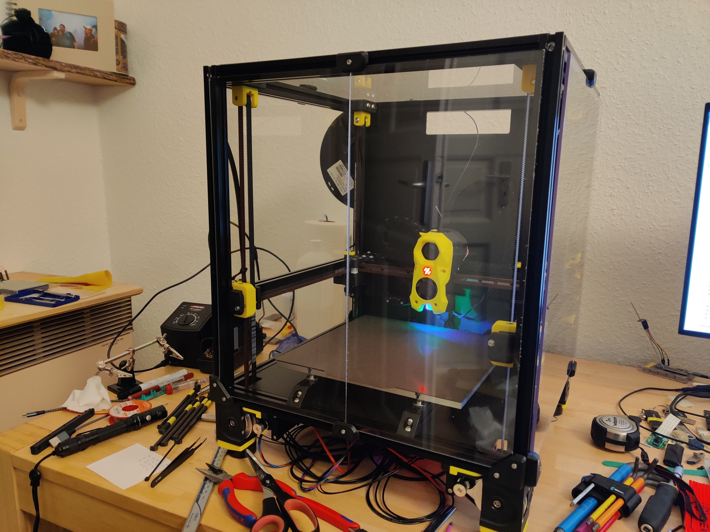

# Voron 2.4

This is my config for my 3D printer, a Voron 2.4r2, 250mm size.

For pretty (and not so pretty) pictures, look at buildlog.md.

## Table of contents

- [config/](config/)         Printer configuration files.
- [manuals/](manuals/)       Assembly, circuitry, etc.
- [mods/](mods/)             Addons for the printer.
- [pictures/](pictures/)     Pictures for the buildlog.
- [buildlog.md](buildlog.md) Buildlog for everything I’ve done on the printer,
                             including time estimates.
