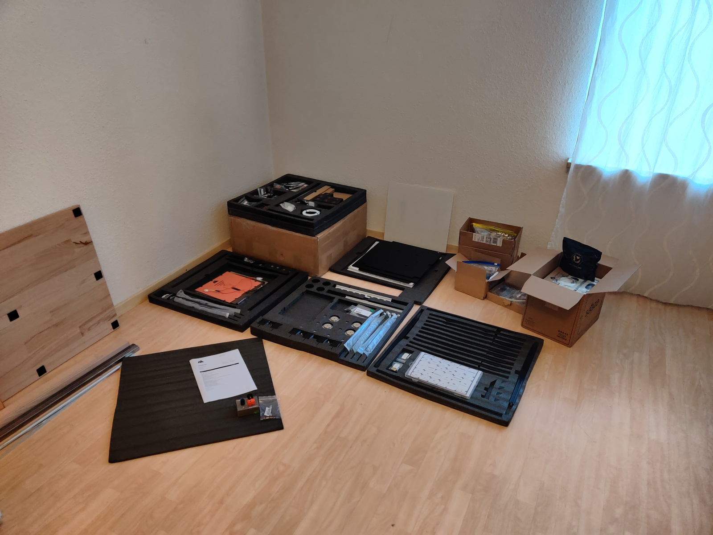
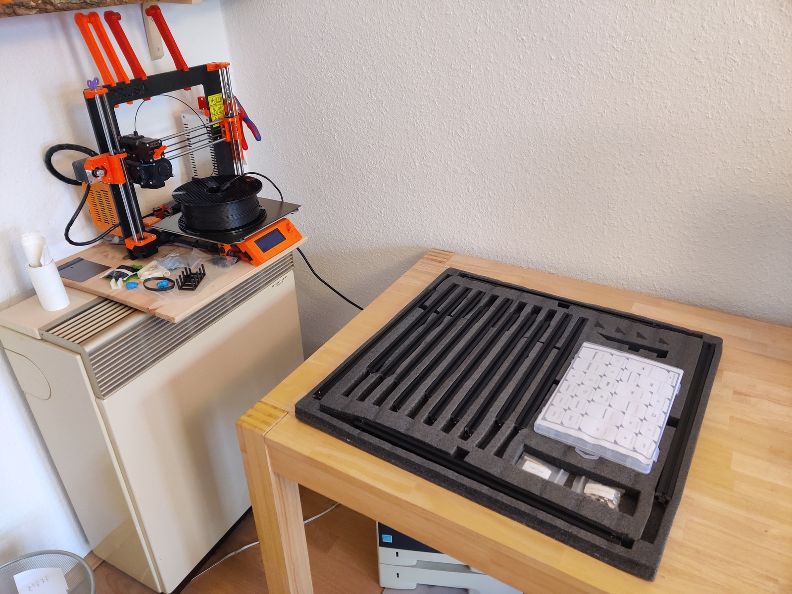
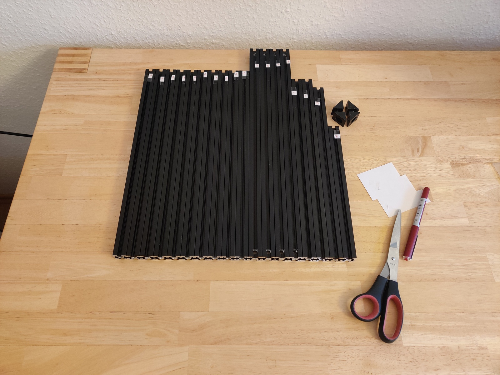
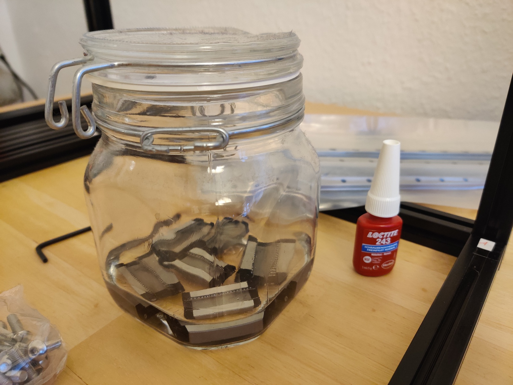
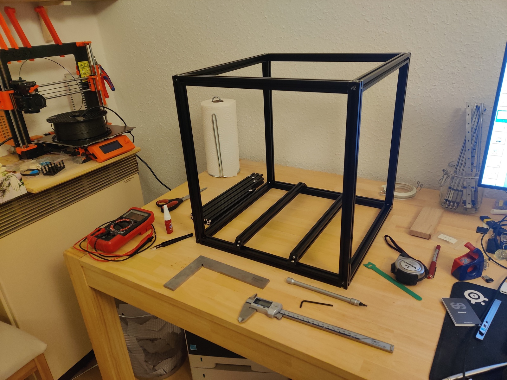

# 2022-10-25

Package arrived. Got Pif parts in blue and yellow.

Around 1 m² of desk space cleaned, my trusty Prusa 2.5 went onto the gas oven
(turned off). Build area cleaned, let’s go!

Time: 15 min

Downloaded the build manual for Voron (and Stealthburner for later). Initialize
this Git repo. 5min

## Frame assembly

Extrusions sorted and labeled. 10 min

Adding screws to A extrusions. I remember my friend telling me about the _frame
spring fasteners_ that they forgot initially. Time to open the
[MagicPhoenix manual](http://mpx.wiki/) as well! Yup, use (non-standard) frame
spring fasteners.

30 min later, cube almost finished, forgot thread locker. Fuck. Anyway, time
to get the DIN angle for fine tuning, and the thread locker. Undo all the screws
again. Need to go boudlering though, and threadlocker would set a time limit on
assembly and squaring. Stopping frame assembly for now.

15 min of unpacking linear rails, finding a suitable glass, and putting the
sliders into IPA. Now I will go bouldering for real, promise.

Time taken: 1 h, total 1.25 h

---

Reassembled the linear rails while drenching them in IPA. Did not expect the
MGN9H to be _that_ hard to get on the rail, MGN12H is a piece of cake in
comparison. Some balls jumped out, reinserting them is super finnicky. Keeping
them on-rail in IPA for a bit longer, and will move them on occasion. Speaking
of movement, only one of the rails is good (sled moves under its own weight),
the rest is average, except for one of the MGN9H, which is quite stiff. Maybe
upgrade to Hiwin later (for a hefty premium …). 20 min for this.

Another 45 min later, the frame is fully assembled, and all corners are
electrically connected (diamond filing the contact surfaces). Used a DIN norm
angle to make sure the mechanical assembly is flush. Upper/lower Diagonals are
all 579 mm, left/right/front/back ones 594 mm without further adjustment. Kudos
to the precision work by MagicPhoenix! Used my DIN angle to check for 90°; most
angles are perfect, some are a tiny bit off so that I can
audibly-but-not-visibly move the angle. Good enough.

I decided against using threadlocker for the frame, because Loctite cures in
around 10-20 min, which would not have let me adjust the screws if things
hadn’t gone to plan. Might add Loctite later screw-by-screw when more things
hold the frame in place, but only if problems occur. Screws are tight so that
when I use the hex key with the worse lever, my finger hurts when turning them.

Installed the heat bed rails by estimating the center of the bed with a tape
measure, and going from there with the caliper. Distance between the extrusions
is 130 mm ± <0.2 mm, way more accurate than I need. I do have an offset by 0.5 mm
to the left though, which I will worry about when installing the bed, which
should give me much more practical guidance.

Time taken: 1.75 h, for a total of 3 h so far. 
