# 2022-10-25

Package arrived. Got Pif parts in blue and yellow.

Around 1m² of desk space cleaned, my trusty Prusa 2.5 went onto the gas oven
(turned off). Build area cleaned, let’s go!

Time: 15min

Downloaded the build manual for Voron (and Stealthburner for later). Initialize
this Git repo. 5min

## Frame assembly

Extrusions sorted and labeled. 10min

Adding screws to A extrusions. I remember my friend telling me about the _frame
spring fasteners_ that they forgot initially. Time to open the
[MagicPhoenix manual](http://mpx.wiki/) as well! Yup, use (non-standard) frame
spring fasteners.

30min later, cube almost finished, forgot thread locker. Fuck. Anyway, time
to get the DIN angle for fine tuning, and the thread locker. Undo all the screws
again. Need to go boudlering though, and threadlocker would set a time limit on
assembly and squaring. Stopping frame assembly for now.

15min of unpacking linear rails, finding a suitable glass, and putting the
sliders into IPA. Now I will go bouldering for real, promise.

Time taken: 1h, total 1h15m.

Reassembled the linear rails while drenching them in IPA. Did not expect the
MGN9H to be _that_ hard to get on the rail, MGN12H is a piece of cake in
comparison. Some balls jumped out, reinserting them is super finnicky. Keeping
them on-rail in IPA for a bit longer, and will move them on occasion. Speaking
of movement, only one of the rails is good (sled moves under its own weight),
the rest is average, except for one of the MGN9H, which is quite stiff. Maybe
upgrade to Hiwin later (for a hefty premium …). 20min for this.

Another 45min later, the frame is fully assembled, and all corners are
electrically connected (diamond filing the contact surfaces). Used a DIN norm
angle to make sure the mechanical assembly is flush. Upper/lower Diagonals are
all 579mm, left/right/front/back ones 594mm without further adjustment. Kudos
to the precision work by MagicPhoenix! Used my DIN angle to check for 90°; most
angles are perfect, some are a tiny bit off so that I can
audibly-but-not-visibly move the angle. Good enough.

I decided against using threadlocker for the frame, because Loctite cures in
around 10-20min, which would not have let me adjust the screws if things
hadn’t gone to plan. Might add Loctite later screw-by-screw when more things
hold the frame in place, but only if problems occur. Screws are tight so that
when I use the hex key with the worse lever, my finger hurts when turning them.

Installed the heat bed rails by estimating the center of the bed with a tape
measure, and going from there with the caliper. Distance between the extrusions
is 130mm±<0.2mm, way more accurate than I need. I do have an offset by 0.5mm
to the left though, which I will worry about when installing the bed, which
should give me much more practical guidance.

Time taken: 1h45m, for a total of 3h so far.

# 2022-10-26: Frame and gantry

## Z linear rails

Spent 15 minutes greasing the rails with standard grease. It’s quite hard to get
it in there, the syringe tip didn’t work (inject it from below through a rail
hole). Just made a little mess and hoped enough would be on the bearings.

The next 45min I installed the rails. I got one nut the wrong way round; it’s
not noticeable but _I know_. It’ll be my secret. Nothing special here, just
juggling with Loctite hardening, and aligning them quick enough. The plastic
rail adjustment clamps are a blessing. Oh and my Yubikey is 3.5mm thick, so I
used that as a spacer for the gap at the bottom of the Z rails.

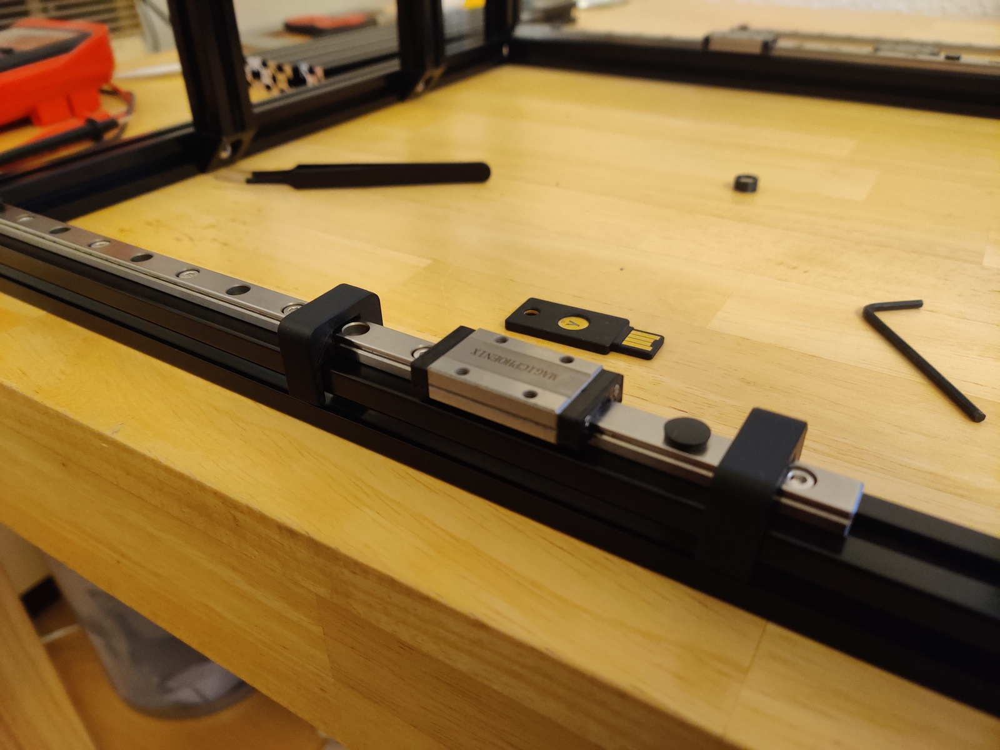

# DIN rails

15 minutes for installing the floor and DIN rails. Initially I installed the
rails parallel to the bed rails, but they actually have to be perpendicular.
Takes a minute to change that though, so no problem.

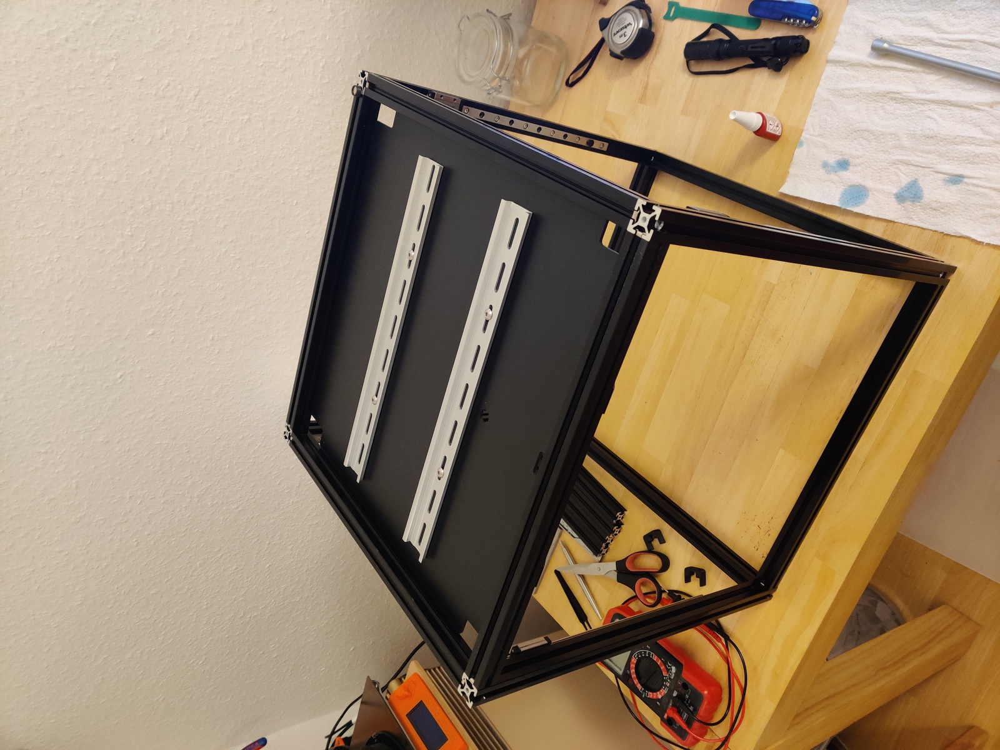

The next 30 minutes were pure bliss: heat inserts. It’s amazing. I hope there
are many more. 250 °C on the soldering iron, slowly pushing it in, then flushing
the surface with a flat piece of plastic for a couple of seconds. All inserts
are _perfect_. I’m proud.

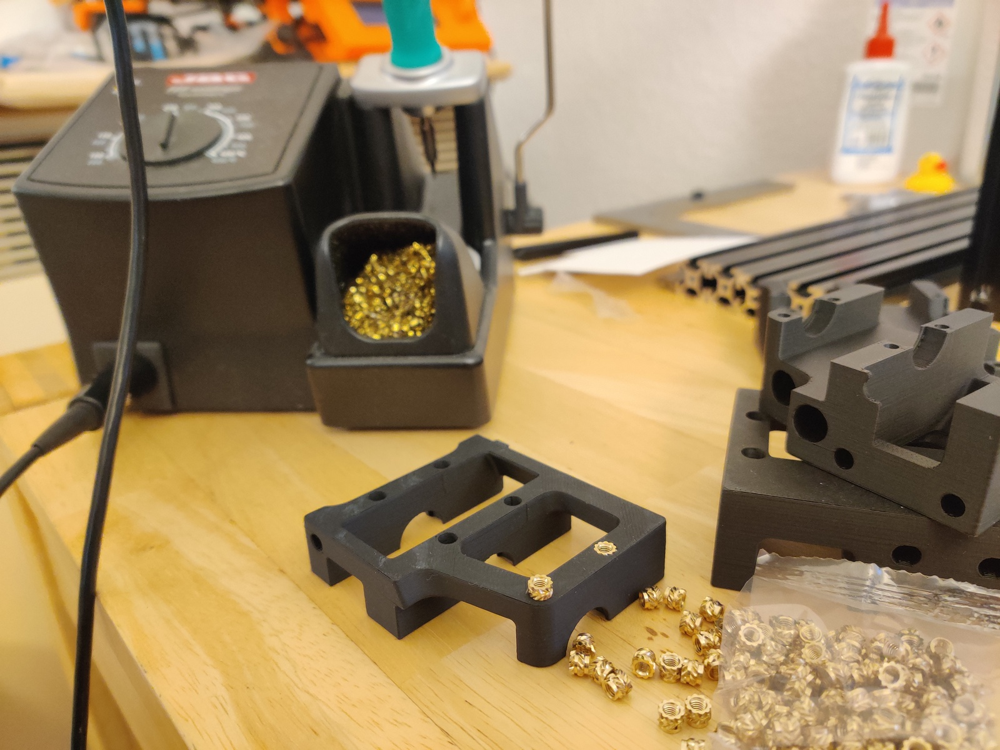

The first foot for the frame to stand on took 45 minutes. A couple of small
mistakes were easy to remedy, namely I screwed the foot onto the wrong side of
the frame, and also I forgot including the M5 nut for the plastic foot’s foot to
be fastened to. Neither took more than a minute to fix.

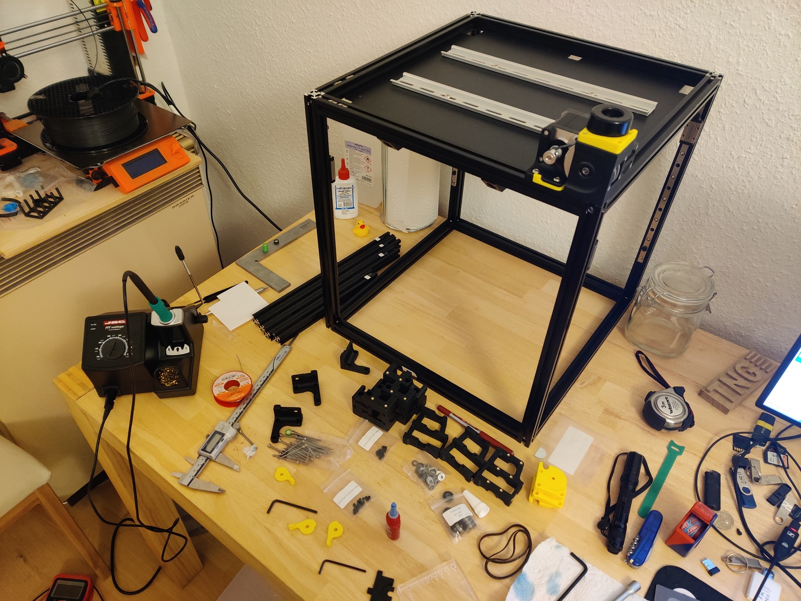

Eyedler are super easy to build and install, maybe 20 minutes. I don’t have a
ball hex key though, so I won’t be able to fasten the belts thanks to their
design.

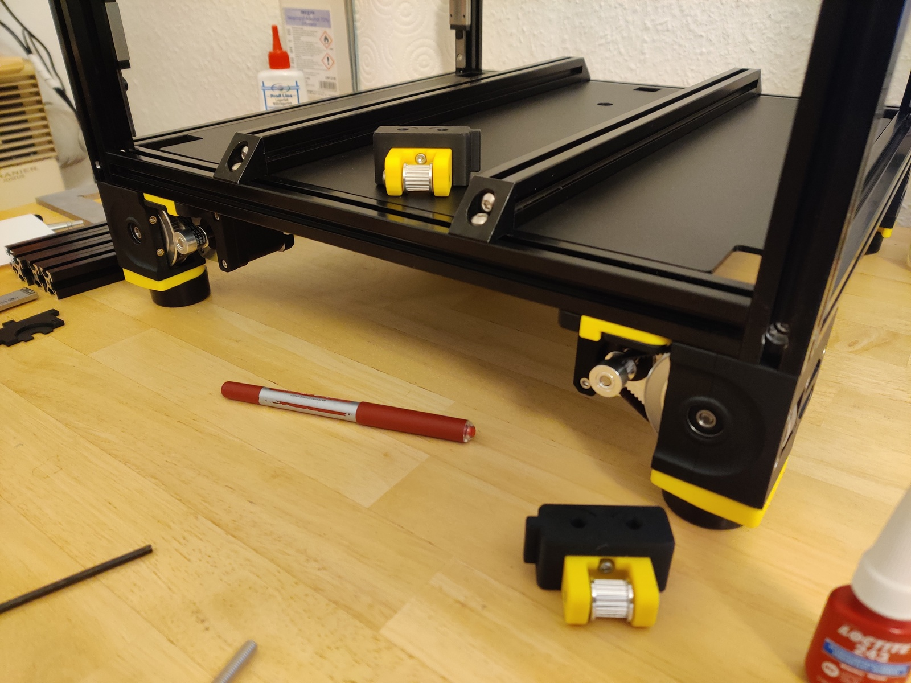

2h30m Session; the frame is now super done, for a total of 5h30m.

## Gantry

Gantry time! At first I thought Pif had forgotten the B idlers, but the parts
just look different, and everything was there. A couple of heat inserts, lots of
screws that I don’t fasten yet because I don’t know whether I should wait for
the wedding with the frame or not.

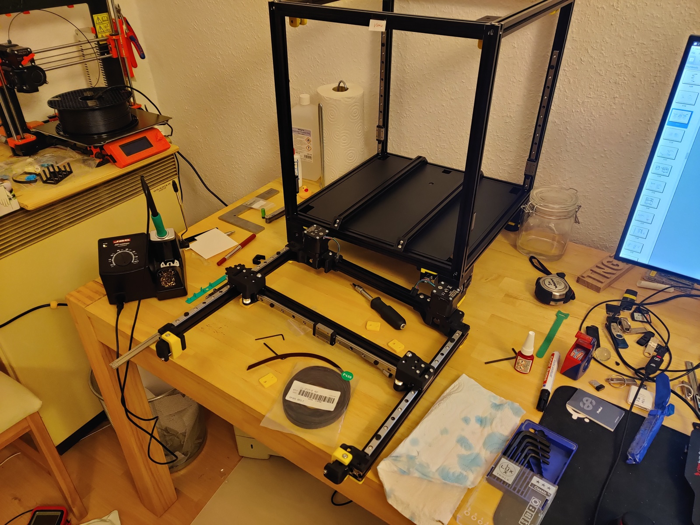

This is also when I noticed the reason my Loctite doesn’t yield drops without
extensive begging because – you won’t believe it – it was empty. Visited my
friend to get backup, and also some useful tips for the coming steps. 60 minutes
so far.

2h more gantry assembly. Lots of screws are only tightened a bit, the goal being
joining it with the frame and then working out where everything should be.

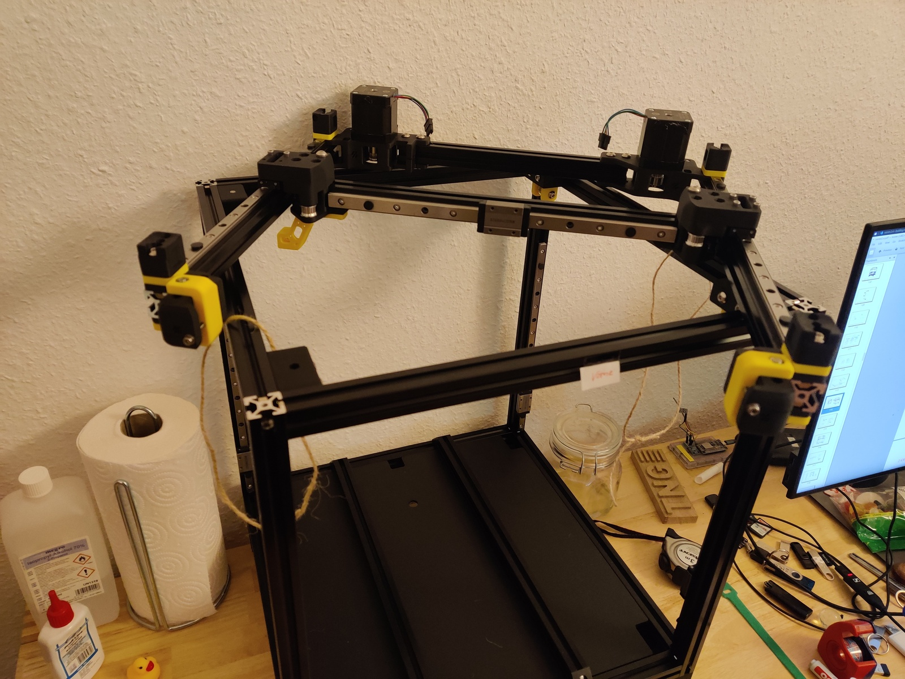

It’s now 0:20, the gantry is done, time for the wedding!

0:40 Wedding is done, but I noticed I misunderstood the Z belts: I should
already have added them on lower clamps. That’s going to be finnicky; I think
it’ll be easier to take out the gantry again, fixing the belts, and while I’m at
it tighten some screws. I’ll really have to remember to double-check all the
gantry screws later.

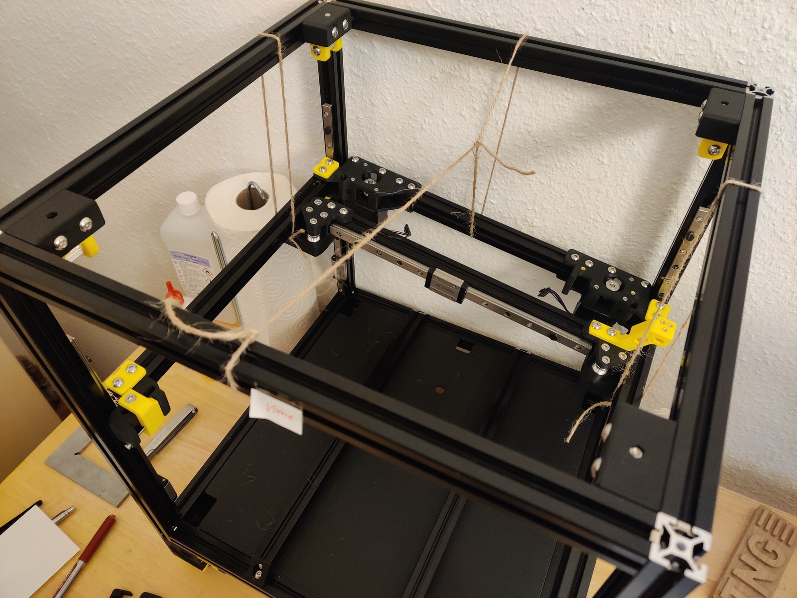

The gantry took me around 3h30m so far, for a total of 9h assembly at this
point.

# 2022-10-27

## Z locks

A cool mod I was recommended is [Z locks][z-locks]. It’s one of those that you
miss when searching for super cool mods before building. It holds the gantry in
place so you can access it without taking it out again. Printed six of them on
the Prusa in less than 2 hours while I was working. The fit is quite tight so
it’s quite secure even if you work on the printer or bump into it. I also cut
the 5m×9mm belt into 1.1m strips of equal length for the Z axes (the manual said
at least 1m for the 250mm printer, so I won’t have usable leftovers anyway).
15min.

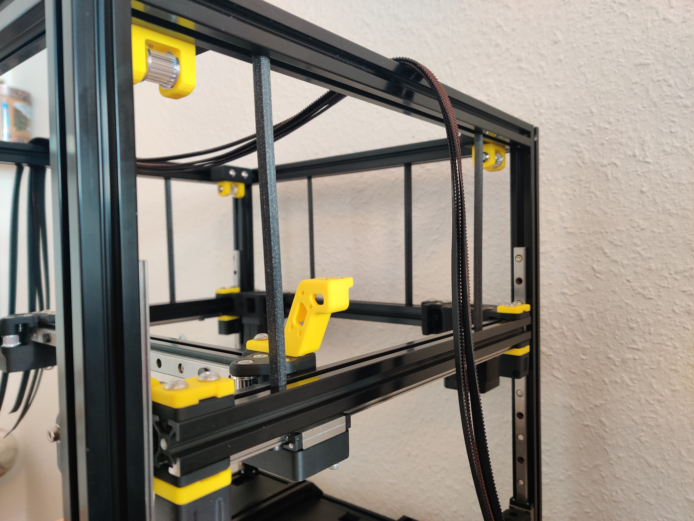

[z-locks]: https://github.com/VoronDesign/VoronUsers/tree/master/printer_mods/tallman5/z-locks

The 15min bring the total time to 9h15.

## Belting

30min for inserting the Z belts. I cut them 20cm too long, the »minimum« of 1m
from the manual would still have had 10cm slack as it turns out. This step is
much easier with the whole thing laying on its back; the Z locks are super
helpful, highly recommended.

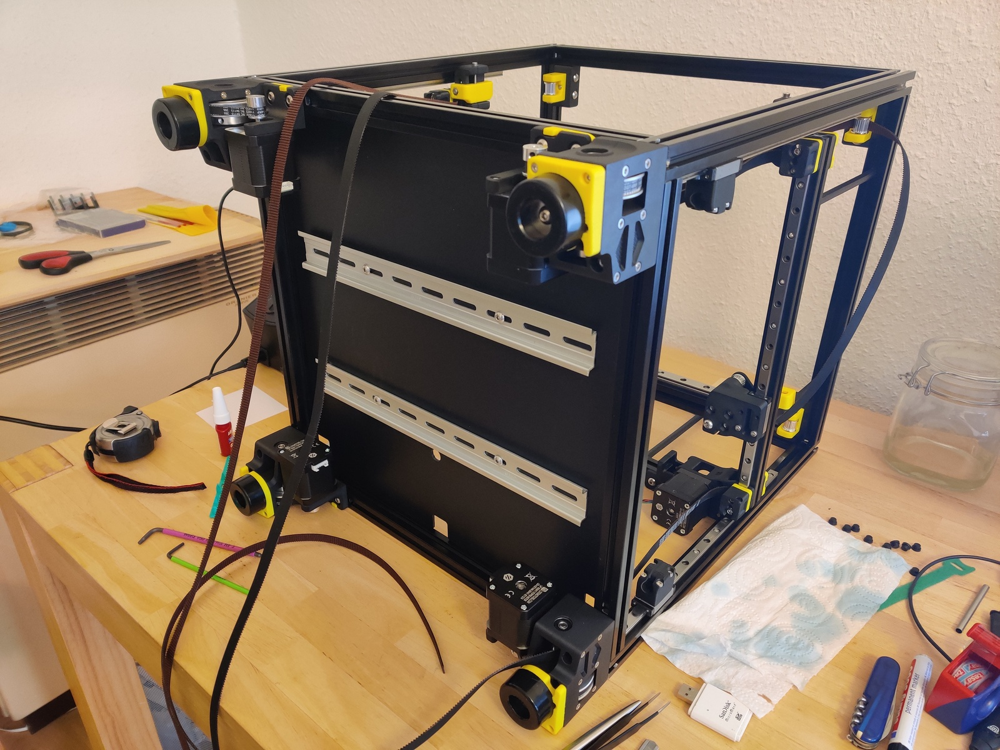

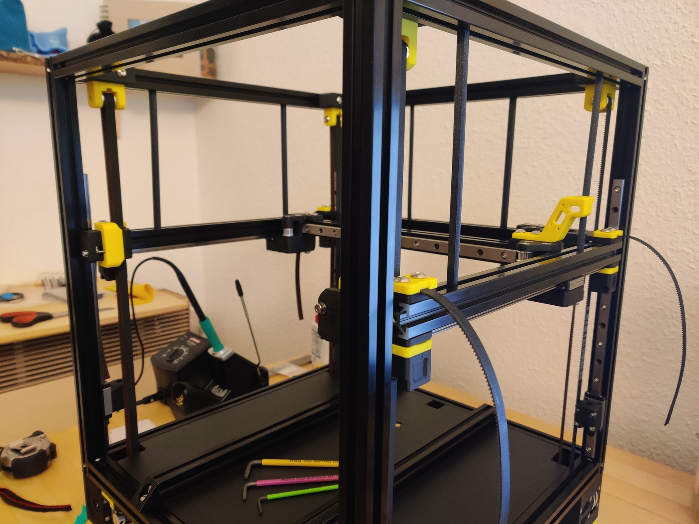

Another 30 minutes later, the A+B belts are done. Some parts are quite finnicky,
but this is also what made it great fun for me, because there was always some
smart way to thread even the bendiest needles.

Alright, what’s next in the manual, ah yes, both belts must have the same
length, because that’s important for tensioning, symmetry, and stuff. Ah yes,
the design is also built in a way that despite both belts taking different
paths, their lengths match. Wellllll then, I guess I’ll take them out.

30s later, 30min of belting undone. At least I know how to thread them now. Cut
them to equal length to the tooth.

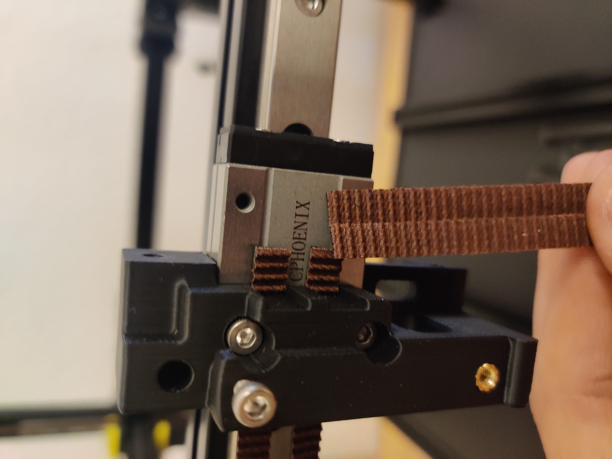

30 more minutes to insert the belts again. I was faster than the first time, but
filled the remainder of the time taken with playing around with the carriage.
Fun was had.

One thing I noticed is that the long M3x40 screw holding the A+B belt clamps
together on the carriage was too long; I used a M3x30 instead, matching the one
in the lower part. The lower one has to leave space for a hall probe magnet, but
still I’m not sure why the top is longer.

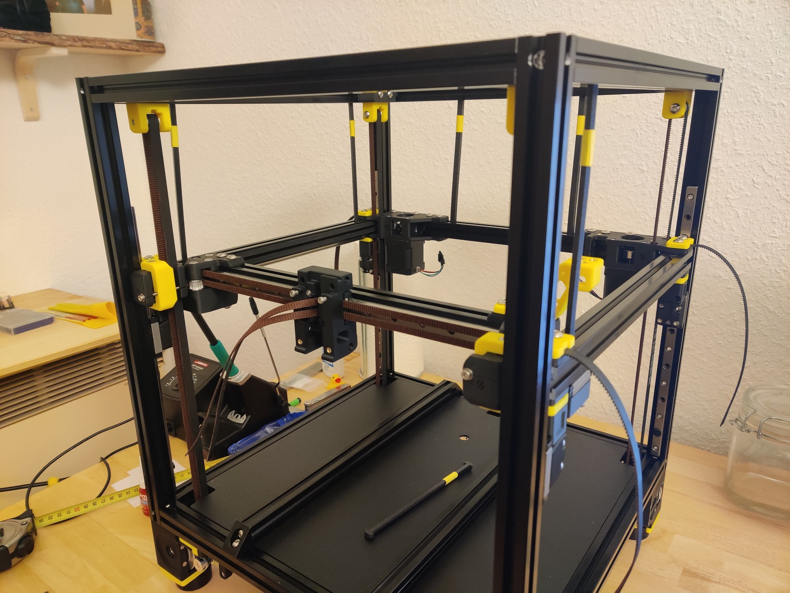

Turns out the machine is already deracked, cool! The carriage moves in Y
direction with constant resistance, with no X drift along the way, and hits the
left end right limits simultaneously. The advice of a friend is to take a look
at the [gantry squaring guide by Andrew Ellis][gsq], which features a couple
more steps, but also assumes wiring for many. It looks like a (chapter from a
much more extensive) great guide that I’ll revisit at a later point.

[gsq]: https://github.com/AndrewEllis93/Print-Tuning-Guide/blob/main/articles/voron_v2_gantry_squaring.md

Oh, plus five minutes to tension the gantry bolts, almost forgot! And lol quite
a few of them were _loose_.

Taking some reading, playing around, and writing this text into account, I’ve
spent 2h on the whole belting topic, with a total of 11h15m so far.

# 2022-10-28 Print head, part 1

## Clockwork

More heat inserts, yippee! Although I must say the design is much less friendly.
Some inserts had shallow sockets so the soldering tip penetrated the plastic,
some were hard to reach without melting other parts. None of the mistakes I made
are visible from the outside though, and even if they were they’re very small.

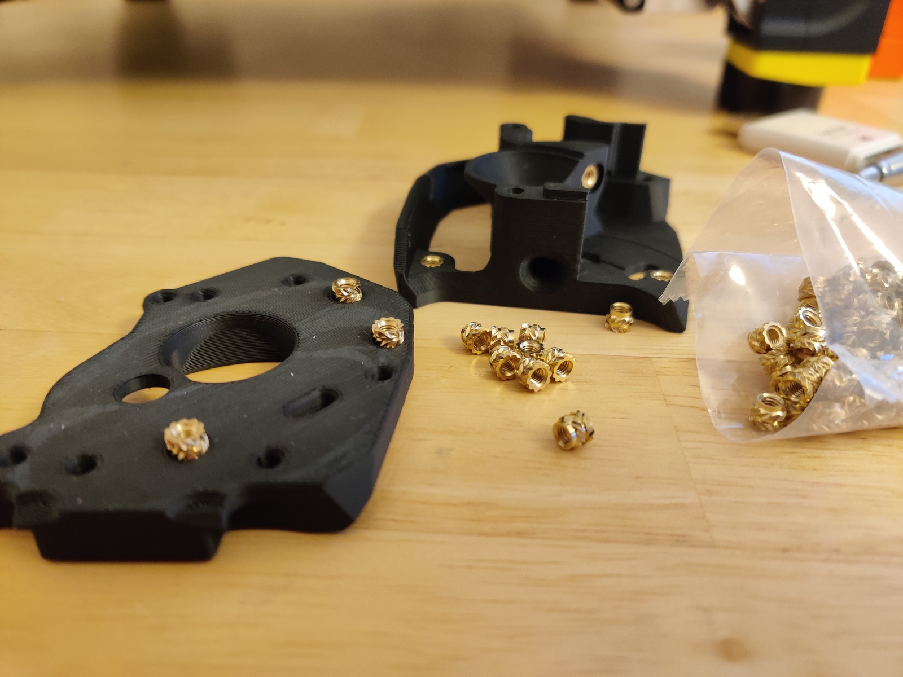

The big gear is supposed to not touch plastic; I therefore moved it inwards as
much as I could. The cost of this is reduced overlap with the driving motor
gear, but we’re talking about less than a mm here on a motor that does not
require much power anyway; it drives filament after all, not a ship’s propeller.

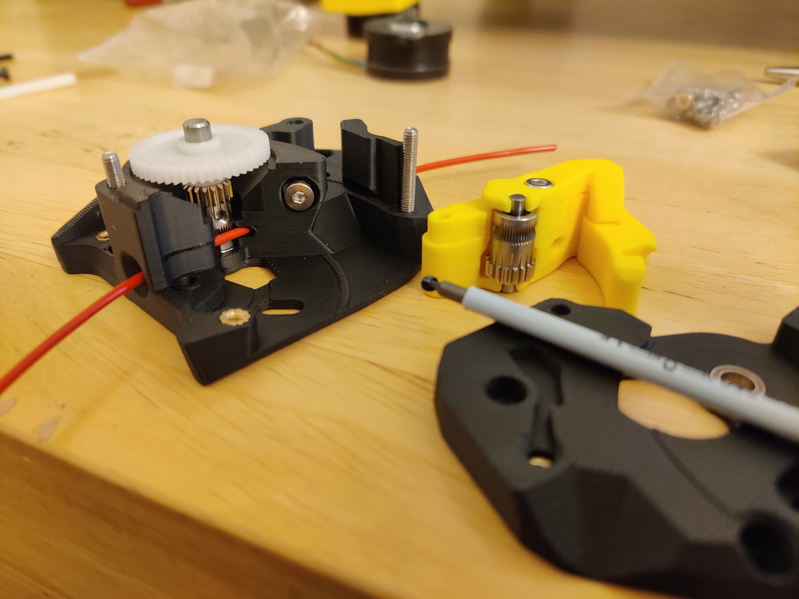

I lubricated the passive extruder gear with trusty Traxxas 50k, a silicon-based
greased that is friendly to plastic, as my collection of Rubik’s Cubes can
attest to. Alignment of parts was pretty easy. I deviated from the manual by
securing the closing latch with a M3x8 SHCS (does fit) instead of M3x6 FHCS
(does not fit) screw.

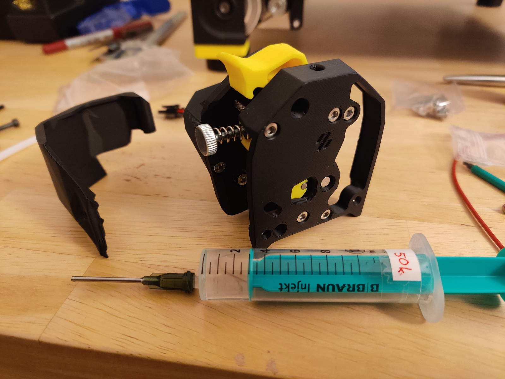

This step took 1h30m. I no longer wonder why it’s called the clockwork, because
everything is hard to reach and see. Maybe also the big gear. Anyway, 12h45m
build time so far.

# 2022-10-31 Print head, part 2

## Hotend

## Stealthburner

I added the hotend; the orientation is such that the beveled end is facing the
front panel. Cable routing required some small amount of force; orienting the
heater makes the cables fall into place more naturally. I had to use the smaller
SHCS M3x8 screws from the hotend bag, the heads of the main kit were too big and
would not fit the four holes in the plastic part. I cut the PTFE tube to stick
out 10.9mm (should be 11mm), but I think that’s close enough. The socket is
designed to hold this whole part on its own, at least enough for adding the
front later. No zipties had to be used to temporarily hold it in place.

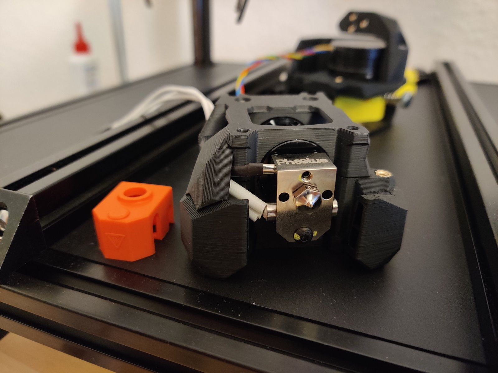

Up next, LED insertion. Smooth sailing; the cables were a bit long, but easily bent into the plastic gaps.

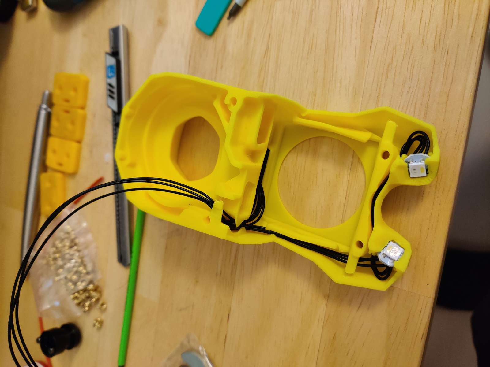

Taking apart the part cooling fan was a bit tricky, but pushing the latches with
my tweezers won after a couple of attempts. I cut off the ears with side
cutters, and filed them down to be somewhat flush. The part doesn’t have to be
super flat, there is some tolerance in the SB head. When staring at the fan from
the front long enough it might not be 100% centered, which might be due to the
non-perfect flush-sanding, but I’ll leave this for a future modding session.

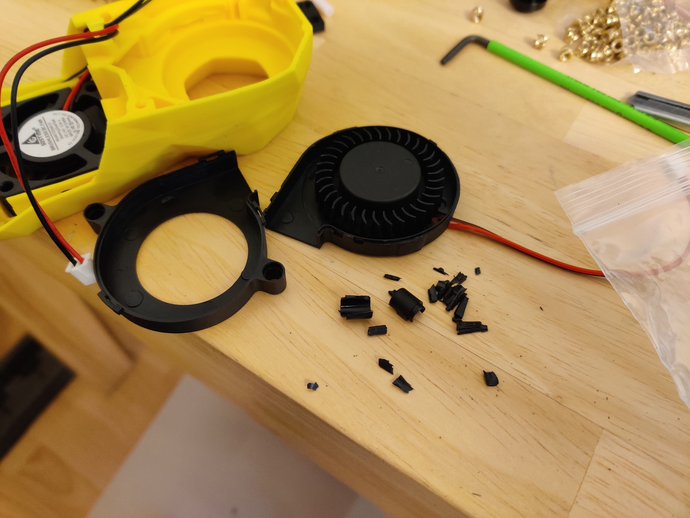

The Klicky probe is easy to install; I did not notice the right way to route its
cable is straight up past the belts and then into a groove made for just that,
and considered just routing it outside. The Voron devs thought of everything it
seems!

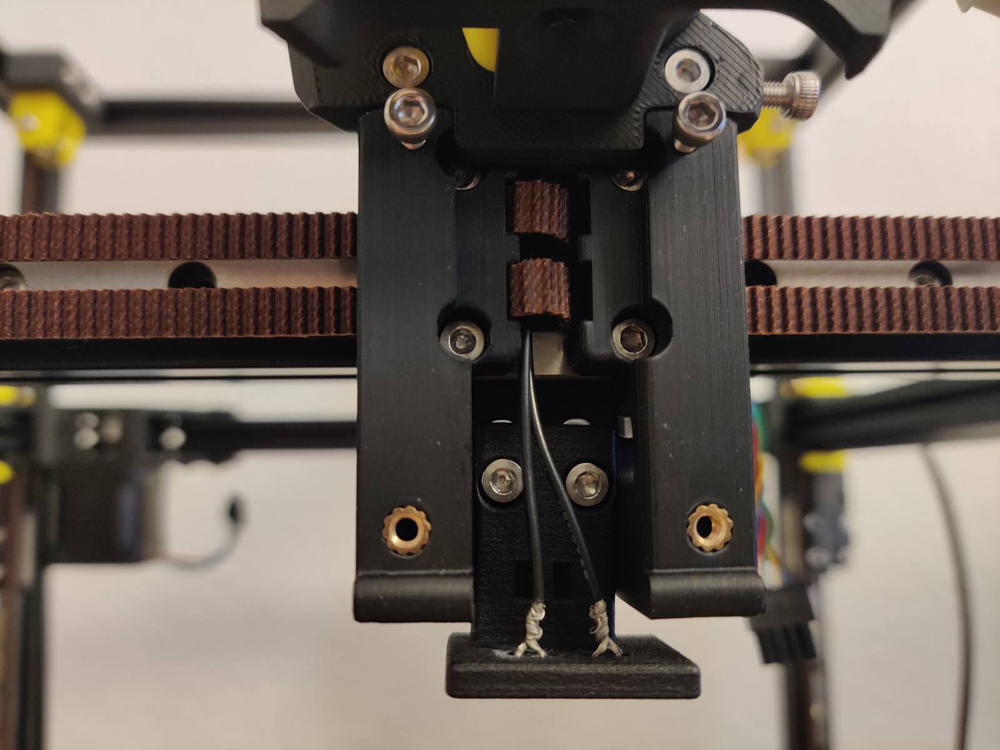

Bolted on the front, and mechanical assembly is done! It looks like a Voron now!

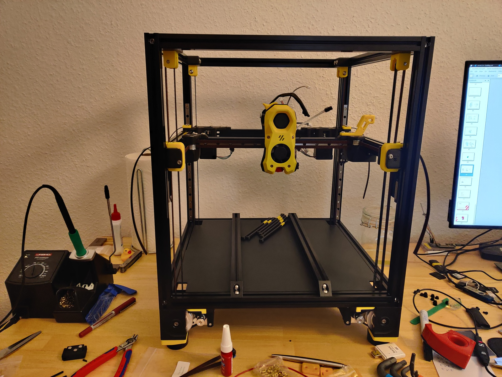

With 1h30m in this session, I spent 14h15m on mechanical assembly.
