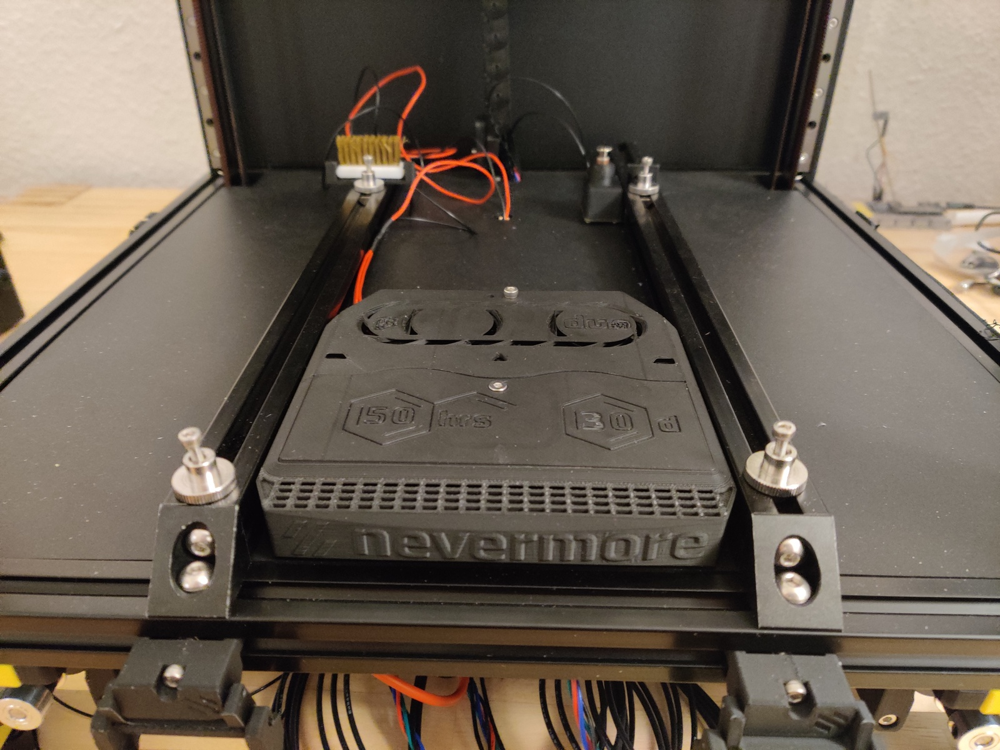
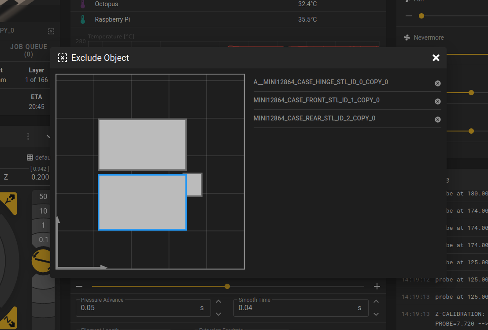

# Voron 2.4 buildlog

This is a technical diary AKA buildlog of me assembling a Voron 2.4r2, 250mm
version.

I try to add annotations where I make mistakes, but in general it’s good to
double-check whether things I’ve described in a step are a good idea before
copying them.

# 2022-10-25

Package arrived. Got Pif parts in blue and yellow.


Around 1m² of desk space cleaned, my trusty Prusa 2.5 went onto the gas oven
(turned off). Build area cleaned, let’s go!


Time: 15min

Downloaded the build manual for Voron (and Stealthburner for later). Initialize
this Git repo. 5min

## Frame assembly

Extrusions sorted and labeled. 10min


Adding screws to A extrusions. I remember my friend telling me about the _frame
spring fasteners_ that they forgot initially. Time to open the
[MagicPhoenix manual](http://mpx.wiki/) as well! Yup, use (non-standard) frame
spring fasteners.

30min later, cube almost finished, forgot thread locker. Fuck. Anyway, time
to get the DIN angle for fine tuning, and the thread locker. Undo all the screws
again. Need to go boudlering though, and threadlocker would set a time limit on
assembly and squaring. Stopping frame assembly for now.

15min of unpacking linear rails, finding a suitable glass, and putting the
sliders into IPA. Now I will go bouldering for real, promise.


Time taken: 1h, total 1h15m.

Reassembled the linear rails while drenching them in IPA. Did not expect the
MGN9H to be _that_ hard to get on the rail, MGN12H is a piece of cake in
comparison. Some balls jumped out, reinserting them is super finnicky. Keeping
them on-rail in IPA for a bit longer, and will move them on occasion. Speaking
of movement, only one of the rails is good (sled moves under its own weight),
the rest is average, except for one of the MGN9H, which is quite stiff. Maybe
upgrade to Hiwin later (for a hefty premium …). 20min for this.

Another 45min later, the frame is fully assembled, and all corners are
electrically connected (diamond filing the contact surfaces). Used a DIN norm
angle to make sure the mechanical assembly is flush. Upper/lower Diagonals are
all 579mm, left/right/front/back ones 594mm without further adjustment. Kudos
to the precision work by MagicPhoenix! Used my DIN angle to check for 90°; most
angles are perfect, some are a tiny bit off so that I can
audibly-but-not-visibly move the angle. Good enough.

I decided against using threadlocker for the frame, because Loctite cures in
around 10-20min, which would not have let me adjust the screws if things
hadn’t gone to plan. Might add Loctite later screw-by-screw when more things
hold the frame in place, but only if problems occur. Screws are tight so that
when I use the hex key with the worse lever, my finger hurts when turning them.

Installed the heat bed rails by estimating the center of the bed with a tape
measure, and going from there with the caliper. Distance between the extrusions
is 130mm±<0.2mm, way more accurate than I need. I do have an offset by 0.5mm to
the left though, which I will worry about when installing the bed, which should
give me much more practical guidance. **Note from the future:** there is a
[simple alignment helper mod][bed-rails-alignment] that would have made this
much easier.

[bed-rails-alignment]: https://github.com/VoronDesign/VoronUsers/tree/master/printer_mods/GadgetAngel/Bed_Support_Alignment_Tools


Time taken: 1h45m, for a total of 3h so far.


# 2022-10-26: Frame and gantry

## Z linear rails

Spent 15 minutes greasing the rails with standard grease. It’s quite hard to get
it in there, the syringe tip didn’t work (inject it from below through a rail
hole). Just made a little mess and hoped enough would be on the bearings.

The next 45min I installed the rails. I got one nut the wrong way round; it’s
not noticeable but _I know_. It’ll be my secret. Nothing special here, just
juggling with Loctite hardening, and aligning them quick enough. The plastic
rail adjustment clamps are a blessing. Oh and my Yubikey is 3.5mm thick, so I
used that as a spacer for the gap at the bottom of the Z rails. **Note from 50h
in the future:** A bigger gap makes it easier to insert covers later. There is
zero need to have the carriages go that deep. Make it 5mm or even 10mm!


# DIN rails

15 minutes for installing the floor and DIN rails. Initially I installed the
rails parallel to the bed rails, but they actually have to be perpendicular.
Takes a minute to change that though, so no problem.


The next 30 minutes were pure bliss: heat inserts. It’s amazing. I hope there
are many more. 250 °C on the soldering iron, slowly pushing it in, then flushing
the surface with a flat piece of plastic for a couple of seconds. All inserts
are _perfect_. I’m proud.


The first foot for the frame to stand on took 45 minutes. A couple of small
mistakes were easy to remedy, namely I screwed the foot onto the wrong side of
the frame, and also I forgot including the M5 nut for the plastic foot’s foot to
be fastened to. Neither took more than a minute to fix.


Eyedler are super easy to build and install, maybe 20 minutes. I don’t have a
ball hex key though, so I won’t be able to fasten the belts thanks to their
design.


2h30m Session; the frame is now super done, for a total of 5h30m.

## Gantry (3h30m)

Gantry time! At first I thought Pif had forgotten the B idlers, but the parts
just look different, and everything was there. A couple of heat inserts, lots of
screws that I don’t fasten yet because I don’t know whether I should wait for
the wedding with the frame or not.


This is also when I noticed the reason my Loctite doesn’t yield drops without
extensive begging because – you won’t believe it – it was empty. Visited my
friend to get backup, and also some useful tips for the coming steps. 60 minutes
so far.

2h more gantry assembly. Lots of screws are only tightened a bit, the goal being
joining it with the frame and then working out where everything should be.


It’s now 0:20, the gantry is done, time for the wedding!

0:40 Wedding is done, but I noticed I misunderstood the Z belts: I should
already have added them on lower clamps. That’s going to be finnicky; I think
it’ll be easier to take out the gantry again, fixing the belts, and while I’m at
it tighten some screws. I’ll really have to remember to double-check all the
gantry screws later.


The gantry took me around 3h30m so far, for a total of 9h assembly at this
point.

# 2022-10-27

## Z locks

A cool mod I was recommended is [Z locks][z-locks]. It’s one of those that you
miss when searching for super cool mods before building. It holds the gantry in
place so you can access it without taking it out again. Printed six of them on
the Prusa in less than 2 hours while I was working. The fit is quite tight so
it’s quite secure even if you work on the printer or bump into it. I also cut
the 5m×9mm belt into 1.1m strips of equal length for the Z axes (the manual said
at least 1m for the 250mm printer, so I won’t have usable leftovers anyway).
15min.


[z-locks]: https://github.com/VoronDesign/VoronUsers/tree/master/printer_mods/tallman5/z-locks

The 15min bring the total time to 9h15.

## Belting (2h)

30min for inserting the Z belts. I cut them 20cm too long, the »minimum« of 1m
from the manual would still have had 10cm slack as it turns out. This step is
much easier with the whole thing laying on its back; the Z locks are super
helpful, highly recommended.


Another 30 minutes later, the A+B belts are done. Some parts are quite finnicky,
but this is also what made it great fun for me, because there was always some
smart way to thread even the bendiest needles.

Alright, what’s next in the manual, ah yes, both belts must have the same
length, because that’s important for tensioning, symmetry, and stuff. Ah yes,
the design is also built in a way that despite both belts taking different
paths, their lengths match. Wellllll then, I guess I’ll take them out.

30s later, 30min of belting undone. At least I know how to thread them now. Cut
them to equal length to the tooth.


30 more minutes to insert the belts again. I was faster than the first time, but
filled the remainder of the time taken with playing around with the carriage.
Fun was had.

One thing I noticed is that the long M3x40 screw holding the A+B belt clamps
together on the carriage was too long; I used a M3x30 instead, matching the one
in the lower part. The lower one has to leave space for a hall probe magnet, but
still I’m not sure why the top is longer.


Turns out the machine is already deracked, cool! The carriage moves in Y
direction with constant resistance, with no X drift along the way, and hits the
left end right limits simultaneously. The advice of a friend is to take a look
at the [gantry squaring guide by Andrew Ellis][gsq], which features a couple
more steps, but also assumes wiring for many. It looks like a (chapter from a
much more extensive) great guide that I’ll revisit at a later point.

[gsq]: https://ellis3dp.com/Print-Tuning-Guide/articles/voron_v2_gantry_squaring.html

Oh, plus five minutes to tension the gantry bolts, almost forgot! And lol quite
a few of them were _loose_.

Taking some reading, playing around, and writing this text into account, I’ve
spent 2h on the whole belting topic, with a total of 11h15m so far.

# 2022-10-28 Print head, part 1

## Clockwork (1h30m)

More heat inserts, yippee! Although I must say the design is much less friendly.
Some inserts had shallow sockets so the soldering tip penetrated the plastic,
some were hard to reach without melting other parts. None of the mistakes I made
are visible from the outside though, and even if they were they’re very small.


The big gear is supposed to not touch plastic; I therefore moved it inwards as
much as I could. The cost of this is reduced overlap with the driving motor
gear, but we’re talking about less than a mm here on a motor that does not
require much power anyway; it drives filament after all, not a ship’s propeller.


I lubricated the passive extruder gear with trusty Traxxas 50k, a silicon-based
greased that is friendly to plastic, as my collection of Rubik’s Cubes can
attest to. Alignment of parts was pretty easy. I deviated from the manual by
securing the closing latch with a M3x8 SHCS (does fit) instead of M3x6 FHCS
(does not fit) screw.


This step took 1h30m. I no longer wonder why it’s called the clockwork, because
everything is hard to reach and see. Maybe also the big gear. Anyway, 12h45m
build time so far.

# 2022-10-31 Print head, part 2

## Stealthburner (1h30m)

I added the hotend; the orientation is such that the beveled end is facing the
front panel. Cable routing required some small amount of force; orienting the
heater makes the cables fall into place more naturally. I had to use the smaller
SHCS M3x8 screws from the hotend bag, the heads of the main kit were too big and
would not fit the four holes in the plastic part. I cut the PTFE tube to stick
out 10.9mm (should be 11mm), but I think that’s close enough. The socket is
designed to hold this whole part on its own, at least enough for adding the
front later. No zipties had to be used to temporarily hold it in place.


Up next, LED insertion. Smooth sailing; the cables were a bit long, but easily bent into the plastic gaps.


Taking apart the part cooling fan was a bit tricky, but pushing the latches with
my tweezers won after a couple of attempts. I cut off the ears with side
cutters, and filed them down to be somewhat flush. The part doesn’t have to be
super flat, there is some tolerance in the SB head. When staring at the fan from
the front long enough it might not be 100% centered, which might be due to the
non-perfect flush-sanding, but I’ll leave this for a future modding session.


The Klicky probe is easy to install; I did not notice the right way to route its
cable is straight up past the belts and then into a groove made for just that,
and considered just routing it outside. The Voron devs thought of everything it
seems!

**Note from the future:** The Klicky holder isn’t parallel to, well, anything.
Make sure when checking the Klicky later that it’s parallel to the bed,
otherwise the effective switch height will be different, which gave me nozzle
calibration issues bad enough to visibly scratch my bed with the nozzle.


Bolted on the front, and mechanical assembly is done! It looks like a Voron now!


With 1h30m in this session, I spent 14h15m on mechanical assembly.


# 2022-11-01 Kickoff for wiring

## Assemble mounts (2h30m)

Raspi, Octopus, SSR: just screwed on the holds without washers. Uneventful. The
power switch is hard to put on the frame when the switch/inlet are put in, so I
had to un-screw it, mount it on the T-nut, and reinsert it. Sexbolt is super
easy to assemble; I added some Traxxas 50k to lubricate it, and of course used
Loctite. The main issue was with the big PSU, it just wouldn’t fit on the DIN
rails. I found out I could simply unscrew the DIN rails, which have a couple of
centimeters play left and right, and retighten them at a more useful distance.


2h30m so far, 2h30m for electric assembly, and total build time 16h45m.

## Octopus setup (30m)

For the Octopus, I first removed all jumpers, as the manual says. I then set all
fans and the probe input to 24V and added the drivers. Should I fry the board,
here are pictures of the electrical setup for later reference.


The gap in the drivers line is because motor 2 (0-based indexing) has two slots,
so I’ve skipped motor 2.2 and only used 2.1. **Note from the future:** thsi was
incorrect, and fixed a later step! There are 8 driver slots for 8 drivers, but
there are 9 motor slots, and the driver in position 2 of 7 (0-based) has two
motor slots that can be driven by the same driver. It is valid wiring, looks
awkward, and would at least not fry the board if done this way.

This step took me around 20min, but I also watched a video on how to assemble
the heatbed which I still have to add, bringing the electrical part to 3h, with
a total build time of 17h15m.

## Wiring AC, part 1 (1h15m)

Wiring is a pain! I spent 1h15m on trying to figure out the pieces of shit UK
clamps, only to realize that I bought Wago clamps for exactly the same purpose.
I didn’t have the mounting clamp handy, so I printed it in PLA, to be replaced
by an ABS version later. I’ve opted for the extrusion mount (instead of the
DIN-based one) because it seems easier to use, at least until I know where the
wires are running, and where I have space left on the DIN rails. Since I’ll
exchange the PLA part with ABS later anyway, I can use that opportunity to
decide for the other design, should I want to.

4h15m on electrical thus far, total build time 18h.

## Intermezzo: heatbed (30m)

I’ve never glued on a heatbed, so here goes nothing! Cleaned the cast aluminium
plate with IPA until _nothing_ was visble on the cloth anymore, then peeled off
a couple of cm of the adhesive cover. Put the entire magnetic sheet on the
surface for alignment, with the partially peeled off cover providing some
resistance so the glue doesn’t stick already. When I was happy with the
alignment (each side a bit wider than the actual aluminium, to be cut off
later), I massaged inside out, with my soldering tip holder plastic piece. It’s
quite the utility, doing this and also helping me with inserting heat inserts
flush! After 15min I was done, no bubble to be seen. I put the result upside
down onto the foam packaging I got the printer parts in, so that the weight of
the plate can help with a bit of pressure when curing.


Next step, the heat sheet. Pretty much the same procedure, same alignment and
partially peeling off tricks, same 15min.


I must say, I think I did this quite well for the first time. No bubbles to be
seen, very symmetric. Since this wasn’t really part of electrical assembly, I’m
leaving that total at 4h15, but the total build time increases to 18h30m.

## Wiring AC, part 2 (1h30m)

Meanwhile, the Wago mount clamp has finished printing, time to continure wiring!
Up to a couple of cables that were too short and constrained my choice of
location for some of the parts, everything went smoothly. Thank you Wago.

Turned on power, the switch works, and the green status LEDs of the PSUs light
up as well. 30min (total wiring 4h45m, total 19h).


For the DC circuit, it looks like the cable to connect both V- of the PSUs is
missing. I’ll have to remember adding this later!

The cable routing is a mess, I’m not sure the cable ducts would be an
improvement though, since space is super limited. And it’s going to get much
worse once the printing wiring is added!

A couple of things are still missing in the power circuits:

1. Grounding the frame and the DIN rails
2. Connecting the V- outputs of both PSUs

Other open questions include what the purpose of the BED_POWER connector on the
Octopus is for, since I thought I was using a SSR for providing power from DC,
controlled via the BED_OUT terminal.

Here’s a picture of the current state for your enjoyment.

1h more spent on wiring, so we’re at 5h45m electrical, and 20h total.


# 2022-11-01: fixing mistakes and power wiring

In the last session, I made a couple of mistakes.

1. I misunderstood the bed connectors of the Octopus. The correct way of wiring
   is that the board routes `bed power` to `bed out` based on a Mosfet, and
   controls heating this way. **Note from the future:** the bed in/outputs
   aren’t needed, because I have a separate relay that a thermal output can
   handle. The bed in/out are only needed when heating the bed directly over the
   Octopus.
2. I also misunderstood `motor power`. This is only necessary if the bed power
   is a different one than the board power. In my case, both are 24V (and not,
   say, 48V for the motors), so I can just leave the `motor power` unconnected.
   The jumpers next to the drivers near the edge are in _use board power for
   motors_ position anyway. This wasn’t electrically wrong (phew!), but needed
   additional cables to connect the `motor power` connector, so out it goes. In
   a future mod, since I’m using the huge relay anyway, I could get rid of both
   the bed connectors, and route some thermal regulator pin to the relay
   directly, since it doesn’t need bed power for switching. The setup right now
   is the one one might use when powering the bed directly from the Octopus
   (with 24V).
3. The gap between the drivers isn’t necessary. There are 9 motor outputs with
   motor driver #2 (0-based) having 2, but the drivers themselves are gap-less.
   I rearranged them neatly. The gap will instead be between the motor
   connectors.
4. In general, I looked at the docs for the Octopus _1.x_, and not the Octopus
   _Pro_. Oops. Not too bad at the moment, but would have me scratch my head
   later when looking for specific pinouts.
5. I did not ground the DIN rails or the metallic frame. I’m literally betting
   my life that none of the live wires touches the frame.
6. The V- outputs of the PSUs weren’t connected. They are now. Since I didn’t
   have thick enough black/red cables, I tore apart a power socket cable, and
   used brown/blue instead. I’m sure this violates some DIN, ISO or geneva
   convention rule, but what can I say, I’m just a theoretical physicist, and I
   promise to fix this later™.
7. The Sexbolt had a bit too much resistance on the piston, making me afraid it
   would get stuck in a hot chamber and maybe with time. I took it apart again
   (scratching out the Loctite, ugh), applied a very thin layer of Traxxas 50k
   that I wiped off again because it was maybe too stiff, applied new Loctite,
   and reassembled. The piston now moved under its own weight, and also during
   gentle shaking. Good enough! (Counting the 30m for this towards total, but
   not electronics, time.)


Time for a last check of everything before flipping the power. There will either
be smoke, no smoke but nothing useful, or I will be able to connect to Mainsail
(which I previously installed on the Raspi).

Flick.

LEDs begin to shine. No smoke, no noise.


Mainsail! Woohooo!! (After connecting the LAN cable. I’ll set up Wifi for the
Raspi next.)

The next steps were spent fiddling with a hub that I haven’t used in ages. My
desktop doesn’t have Wifi, I forgot adding Wifi credentials on the Raspi, and my
laptop doesn’t have its SSH key authorized by the Raspi.

Once connection was established, the dashboard wouldn’t appear because some
necessary-and-essential fields, such as the MCU, the kinematics, and motor pins
weren’t specified. I used dummy values copied from an example config to quiet
the errors.

It then could not connect to the MCU. How could it, there is no firmware on the
Octopus after all! I had to get a Micro SD, and followed the
[Klipper documentation to flash the MCU][klipper-flash]. Simple enough, `make` a
bit, then copy the compiled `klipper.bin` onto the SD, renaming it to
`firmware.bin`.

I’ll have to come up with a way to version the files. For now, I’m editing and
copying them between host and Voron manually.

[klipper-flash]: https://docs.vorondesign.com/build/software/octopus_klipper.html

Lo and behold, I have a dashboard! I did not dare push any buttons as to not use
any of the nonsense pins I entered, but we’re in software land now! Well, save
for all the wiring still to be done. The golem has arisen from the dead, while
it is still paralyzed, it is able to think and communicate.


Keeping track of time is becoming more and more complicated. I’m adding 1h for
setting up Mainsail OS on the Raspi (which I had done before the parts even
arrived).
  - Mechanical: 14h15m + 30m (Sexbolt) = 14h45m
  - Electronics: 5h45m + 2h30m (wiring, booting) = 8h15m
  - Software: 1h (MainsailOS)
  - Total: 20h + 4h = 24h


# 2022-11-03

Setting up temperature graphs in Mainsail for the Raspi and MCU temperatures was
simple, and took maybe 15min (software). Now I have some graphs!

Since I skipped bed installation (_way_) earlier, now is the time. The glue has
cured, and I can cut off the excess. I also cut gaps so I can screw the bed to
the rails. The first two are abominations, the second two are alright. I’ll keep
the PEI sheet on as much as I can so nobody notices. 30min mechanical.


Took a break (bouldering), then started a new session at 22:00. Cable chains time!

22:20 toolhead PCB mounted. Needed special part to hold it, but my friend got it
for me ahead of time, cool. (Why does Magicphoenix ship their own non-standard
PCB? Who knows.) Toolhead PCB: 20min. Has internal thermistor (for chamber
temperature measurement, which is a _terrible_ idea to measure so close to the
hotend), but that shares its slot with, well, the only thermistor slot, so that
one goes to the hotend one of course. Fans jumpered to 24V.


22:40 toolhead cable chain mounted, but it’s the thick one, meant for the
electronics-to-gantry part. Argh. Cannot use it because its minimum radius is
too big (and also because it’s needed for the Z axis).

23:00 X cable chain correct. It had just the right length: one element less and
X would be limited, one more and it would hit the window.

23:40. Y cable chain assembled. Left 3 elements out. Realized I forgot the
heater input for the toolhead. Fuck. Fiddle that through the X and Y chains.

1:15. Everything made its way down to the electronics compartment. Cable routing
is surprisingly unfun. I used very few zipties, slacking up the cables is
something I’ll do once wiring is finished at the bottom; the cables are long
enough anyway. Breakout PCB shoehorned onto one of the DIN rails, using a
leftover plastic part as spacer so the soldering tips don’t penetrate the
plastic it lies on. Added Z motor wires, and calling it a day. It’s a terrible,
terrible mess for later clean up.


Times:
  - Mechanical: 14h45m + 30m (bed) = 15h15m
  - Electronics: 8h15m + 3h15 (cable chains) = 11h30m
  - Software: 1h + 15m (temperature graphs) = 1h15m
  - Total: 24h + 4h = 28h

# 2022-11-04

## Session one: wiring (45m)

Broken window theory proves correct again, I’m making more of a mess because
there is a mess already.


Started machine: does not smoke. Connect to Mainsail. I see the heater
temperature!

## Session two: configuration out of home (2h)

Time for some configuration. Spent two hours giving the pins aliases. I did not
have the Voron available, so I configured the motors blindly with _lots_ of TODO
entries. Around 2h spent on software here.

## Session three: back home

### Wiring

My workplace is a terrible mess, the Voron’s wiring pales in comparison. I’m
starting to dislike having to literally jump over and losing other things. 15m
spent on cleanup, which was surprisingly quick to get back to a reasonable
level.

The next hour went into installing the Sexbolt (super quick) and the bed wiring
(not super quick since MagicPhoenix made the connector too big to pass through,
so I cut, crimped and wago’d it). I dread the wire cleanup. But config and
testing first! I also removed the circuits to bed in/out ports of the Octopus,
since the bed pulls its power from mains via the big relay, and that one can be
triggered using a normal heater output.

I thought about skipping LED wiring for now, but I’m glad I went for it, because
I was missing a cable! Where was it? Turns out I wired probe1 (meant for
inductive) instead of probe0 (Klicky). Klicky has two poles, inductive 3, so
that’s where my cable was hiding! Anyway, LED wired, Klicky wired.

### Stepper buzzing

Time to test the motors! Wiggle them using

```bash
STEPPER_BUZZ STEPPER=stepper_x  # moves towards front/right
STEPPER_BUZZ STEPPER=stepper_y  # moves towards back/right
STEPPER_BUZZ STEPPER=stepper_z
STEPPER_BUZZ STEPPER=stepper_z1 # needs inversion
STEPPER_BUZZ STEPPER=stepper_z2
STEPPER_BUZZ STEPPER=stepper_z3
STEPPER_BUZZ STEPPER=extruder   # E>0 moves up; not sure what direction is right
```

All motors move, but both steppers going towards the right when buzzing sounds
wrong. There’s [a helpful entry in the MagicPhoenix wiki][mpx-corexy-debug] to
help with that though. I can’t move the gantry without homing it first though.
Is there an override? Let’s worry about homing first.

[mpx-corexy-debug]: https://mpx.wiki/corexy_incorrect_xy_direction

### Homing switches

Klipper has a handy endstop test section in the machine config (why _there_?).
Manually triggered them and looked for a change in state. XYZ work, but Klicky
probe does not register.

Without homing, I can’t move; without moving, I can’t figure out what physical
direction the logical direction X corresponds to. But I _can_ set the homing
speed super slow and home! X goes in the right direction (right side), while Y
is inverted (towards front instead of back). The
[MagicPhoenix wiki][mpx-corexy-debug] says to flip motors in that case, which
was indeed the solution.


### LEDs

Configuring LEDs is pretty simple. Add the config section, use `SET_LED` to set
colors. Indexing starts at 1. Moved LED config to a sub-file, which is something
I’ll be doing with most config files in the future. Note: scp is garbage at
copying directories. It took me longer than a minute to do so correctly, so I
gave up (will downloading work, who knows, will it override my home dir, who
knows). Seriously, fuck the UX and manpages of _so many_ Linux tools.


### Fans

The fans worked right away. The part cooling fan can be controlled, the hotend
fan was tested by setting its threshold temperature to 10°C.

### Hotend heating

Bed and hotend were within a degree from each other, which I estimated is the
resolution of the thermal probes. Hotend fan worked. Time to heat it up, no? It
worked, but overshot the (conservative) target of 60°C by about 3°C. It’s
reassuring that the hotend cooling fan turned on immediately, and stayed on
until the temperature dropped below 50°C. Overshooting by 3°C isn’t that great
though at a test temperature of 60°C. I also heated to 100°C, 200°C and 260°C
(ABS printing temperature), it worked as expected. Once cooled down a bit I
think it’s time for PID calibration via
`PID_CALIBRATE HEATER=extruder TARGET=60`.

### Bed heating

Same procedure. 60°C first, works, with a single cracking noise; something
wasn’t set yet. I’m not too worried, because I did leave the screws of the bed
pretty loose, as per the instructions. Next, get some PID calibration for the
bed via `PID_CALIBRATE HEATER=heater_bed TARGET=60`.

While waiting for the results, I figured I might as well try out the extruder,
and indeed, as suspected in the buzzing test, it goes the wrong way. A simple
reversal of the direction pin should fix this.


### Chamber temperature sensor

Added sensor to config, reading looks okay, slightly above room temperature,
which makes sense after the bed heating test.

Times:
  - Mechanical: 15h15m + 15m (sexbolt, cleanup) = 15h30m
  - Electronics: 11h30m + 1h45m (bed, thermistors, sexbolt) = 13h15m
  - Software: 1h15m + 2h (config, blind) + 3h (config: buzz, homing, LEDs, fans,
    heating) = 6h15m
  - Total: 28h + 7h = 35h


# 2022-11-05

## Trello

I’m losing track of things to do, so I’ve created a Trello board to keep my
TODOs better than as a loose collection of comments here. Let’s see how that
goes. **Note from the future:** This was a good idea. So many things to do and
try.

## Sexbolt Re-reassembly (15m)

The bed of the MagicPhoenix kit is a bit higher than the normal bed, so the
Sexbolt was sitting too low for the nozzle to touch. Took it apart again
(distance to bed: 2.6mm), removed the Loctite residue with acetone (doesn’t work
that well, but worth a try) and reassembled it, but adding just a bit shy of
2.6mm to the screw by not fastening it to the end.

## Fixing the Klicky

The Klicky probe would not trigger during the previous end stop switch test. I
quickly debugged this by ~~being a genius~~ remembering my friend mentioning a
similar problem. And indeed, comparing the pinouts of the Octopus and breakout
PCB, it turns out the cable was flipped: GND went to signal and the other way
round! Seems like it’s a bug in the MacigPhoenix kit, and not a one-time fluke.
Using some very sharp pliers I undid the PCB plug and flipped polarity.

Tested it, and: it works! When attached, it triggers when pressed and does not
trigger when not. When not attached, it is set to triggered, so that failing to
pick it up for some reason does not start probing the bed without it.

## Configuring Z homing

Z homing has to be done by pushing the nozzle onto the Sexbolt, so the location
has to be precisely configured. But wait, I can’t do that because the travel on
the X/Y axes isn’t set correctly, so the Sexbolt position is not know so …

## Calibrating X/Y axes

This is a simple calculation,

rotation_distance = <full_steps_per_rotation = 200> * <microsteps = 32> / <steps_per_mm>
steps_per_mm = 200 steps/rotation * 1/20 rotations/tooth * 1/2 tooth/mm


## Z homing, for real now

Homed X and Y, started Z homing to move Z close to the bed, triggering the
Sexbolt when the nozzle was close to it. Then manually moved XY to (180, 257),
right above the Sexbolt. Homing works! I just have to be careful the wires still
hanging out of the toolhead don’t catch on anything. Zip ties are on the TODO
list.

## Adjusting Klicky height

I put in the Klicky holder without worrying about its height or alignment. This
requires some mechanical disassembly. Turns out it’s super easy! 5 minutes max.
Unscrewed Stealthburner (4 screws), took out hotend, adjusted Klicky holder to
be at the very bottom, put everything back together. I chose the very bottom
because it was already on that height on one screw, and it looked okay before,
just a bit slanted.

I also downloaded the [Klicky macros from the Github page][github-klicky-macros].

[github-klicky-macros]: https://github.com/jlas1/Klicky-Probe/tree/main/Klipper_macros


## LEDs misbehave

I noticed the LEDs sometimes show the wrong color, e.g. (R,G,B) = (1,0,0) yields
a teal LED. I don’t care about it enough to debug it right now, but it’s
something to fix later.

## Calibrate extruder, part 1

When ordered to extrude 10cm of filament, the extruder should do just that.
Apparently that’s often not the case, so I’ll start melting some first plastic!
Window is open because I have an un-enclosed un-nevermored cancer fume machine.
I’ve also tightened the nozzle, carefully, with a size 7 nut (and only a nut).

Now: unpack some ABS, and heat the hotend to 250 °C. Before doing this, I
noticed that it won’t let me extrude anymore because nozzle temperature is below
200°C, which I had previously configured. Nice! I then inserted some filament
(Esun black) with the clockwork open, pushed it all the way through, and got my
first extrusion.


Next step, calibration. I cut off the filament at 40mm above the Clockwork, and
told it to extrude 30mm. It extruded maybe one in this extrusion test #1. Come
to think of it, I should have done some config sanity checks before! Anyway,
22mm are still sticking out, so I extruded 40mm-22m=18mm, off by a factor of
30mm/18mm. I could now modify the config value by this factor but – wait, I have
this config value twice (33.500 and 22.6789511 a bit further down)! What’s the
setting Klipper actually uses in this case? Argh.

I’m keeping the value of 22.6789511, which the documentation says it’s a »good
starting point«. A very specific one, but okay. Alright, ew filament. Wait, how
do I change filament? Umm retract a bit, open Clockwork, and pull I guess. Works
well enough, although I’m a bit worried this might get some molten plastic onto
the extruder gears.

Extrusion test #2. This time, I put a little indicator (electrical tape) onto
the filament at 100mm. Ordered once again 30mm for extrusion, 18mm were
_actually_ extruded. I guess now I know that later values override previous one
in Klipper (at least in this case). The good news is that I can just apply the
factor 30/18 from above to the `rotation_distance`, which is then $22.6789511
\otimes \frac{18}{30}$. Wait, what’s $\otimes$? It’s the
I-don’t-know-whether-to-multiply-or-divide operator. Does 37.8 or 13.6 sound
like a more plausible result value? Underextrusion (18mm instead of 30mm) means
the rotation distance is too high, so the gears move less to extrude some
amount. 13.6(…) it is!

New attempt, extrude 30mm; marker went from 83mm to 53mm. Pretty good!


For some finer calibration, I’ll use up the rest of the test filament I’ve
inserted. While at it, I might as well use my caliper for some better
measurements. Moved filament marker way up. 177.33mm it says. Alright, extrude
150mm! Wait, skipped steps? Fuck fuck fuck. The heater has turned off in the
meantime, I extruded at slightly above 200°C so the safety didn’t kick in, but
extruding cooled the nozzle to 170°C. At least nothing broke! Alright, fiddling
with filament pieces is annoying, I’m getting the spool holder ready. For some
reason that one is part of Pif, even though it’s not super necessary to get
anything done (unlike e.g. the side panel fasteners, which are pretty much
_required_ for ABS printing).

## Spool holder (15m)

Simple enough, followed the instructions. I didn’t glue the PTFE tube into the
holder because it is bent in one direction from being spooled up, and that could
be used to have a tight mechanical fit.

## Calibrate extruder, part 2 (2h30m)

I cut ~10mm of PTFE tube open so I could clip it around the filament, which now
has its other end hidden deep into a big spool. This is my new extrusion marker.
Good idea, but unfortunately both hard to get onto the filament, and then it
doesn’t hold onto it very well, because completely unknown to me, PTFE is quite
slippery. Back to electrical tape it is.

Extrusion test #3. 192.81mm until marker, extrude 150mm at 5mm/s
(note: 10mm/s skips steps!). Marker is now at 45.52mm, so actual feed was
(192.81 - 45.52)mm = 147.29mm, underextrusion, `rotation_distance` is too high
by a factor of 150mm/147.29mm. Old `rotation_distance`) * 147.29/150 is the new
value, 13.36(…).

Extrusion test #4. 203.31mm until marker, extrude 150mm at 5mm/s. 52.91mm until
marker, 150.39mm extruded. We’re in sub-mm territory, good enough, but since we
already have the value, I might as well add another round of calculation. This
time it was an overextrusion, so the `rotation_distance` needs to increase by a
whopping 150.39/150. (We’re well below my measurement accuracy, and of course
the filament isn’t straight, but this is fun so I’m still doing it.)

Final value: `rotation_distance = 13.396270810234196`. Extruder calibration
done! Only took about 2h30m.

Times (it’s been a while, time for an inter-session summary):
  - Mechanical: 15h30m + 15m (Sexbolt boogaloo) + 15m (spool holder) = 16h
  - Electronics: 13h15m + 30m (Klicky) + 15m (fooling around) = 14h
  - Software: 6h15m + 1h (axes calibration, Z homing) + 2h30m (extruder config) = 9h45m
  - Total: 35h + 4h45m = 39h45

## Klicky probe: attaching, homing, docking

The next blocker on the way to the first print is the Klicky probe, for which I
have only ensured it triggers correctly.

First part, mechanical assembly. Super simple, two heat set inserts, T nuts into
extrusions, 15min, done.


Software is next. Surely I’ll need the Klicky location for that, so let’s figure
this out. Wait a second, the holder on the print head crashes into the
gantry-attached holder if I do that, the toolhead holder is too low. But even if
I fix that, doesn’t that mean part of the print bed is inaccessible, because
during a print the Klicky would be picked up?


I just worked on configuration for 2h, let’s see what I can still remember for
the build log. So, homing XYZ works, but is now done by the Klicky scripts,
which override the normal homing procedure to take into account that the probe
might still be attached. Other than that, they’re not that different.

The general idea is that the Klicky is outside of the printable area, around 1cm
besides the bed, so that it does not constrain the printable area. The location
of the probe is configured in the XY plane, and since it is attached to the
gantry, co-moving with and thus independent of Z. G28 (home all) drops the probe
if necessary, then does a usual homing cycle of X, Y, then Z. The `attach_probe`
picks up the probe coming from the front, and `dock_probe` moves it back into
its dock and gets rid of it by moving to the positive Y direction. This is my
test program:

```
G28
attach_probe
G01 X125 Y125 # Probing stuff goes here
dock_probe
```

Configuration wise, I’ve simply copied the `Klipper_macros/*.cfg` files of the
[Klicky repository][klicky-github] onto the printer. `klicky-variables.cfg` is
the configuration, the rest of the files don’t have to be touched for this step.
I heavily reduced all speeds for the probe for testing; however, the only
crucial setting is the `docklocation`, which much like the location of the
Sexbolt, I manually figured out by nudging the print head there.

[klicky-github]: https://github.com/jlas1/Klicky-Probe

## Quad Gantry Leveling (15m)

QGL probes the bed on its four corners, and adjusts the Z motors so the gantry
is parallel to the print bed. Configuration is simple enough, it pretty much
comes out of Klicky and setting the probing coordinates.

## Measure bed mesh

Now that the gantry is level, it’s time for having a look at the bed!


0.071mm variance. I don’t know whether that is very good, but it certainly isn’t
terrible considering it’s well below a typical layer height.

**Note from the future:** I should have written down how I did this. Simply
click the _Calibrate_ button in Klipper?

## Test print? Test print!

Some more configuration, write macro for starting/stopping prints that home,
QGL, all the things. 30min.

Since I’ll be printing ABS, I decided to attach the panels earlier rather than later.


And now let’s print the cube! Here are the first couple of layers:


lol, the Z offset is _off_. If the nozzle has the wrong height, at least I had
the non-damaging version of it!

After a few hours I found out multiple things.
- SuperSlicer allows setting a chamber temperature, Prusa does not. SuperSlicer
  it is from now on.
- The slicers generate Z moves with a feedrate of 18000, oh wow. No surprise
  movements are bonkers when the print starts. I set a maximum feedrate of
  40mm/s for the Z axis in the Klipper config, a 450-fold decrease.

And reprint. It’s a cube! Finally!


I can’t quite get a bearing in without hammering on it, but the exterior measurements are spot on.


The first layer was _terrible_ though, the Z offset was wrong, and I manually
had to add a bit to it. I used the textured sheet because I don’t like it much
and it’s a good spoil surface. I’m now printing a 3-layer high box just so I can
hopefully peel it off the print sheet and get the otherwise irremovable residue
of the cube’s skirt off.


Times are hard, I lost track of time, but I think including breaks I spent
around 12h (wat) on the printer today, all of it on configuration.

  - Mechanical: 16h + 15m (Klicky) = 16h15m
  - Electronics: 14h
  - Software: 9h45m + 2h (Klicky) + 15m (QGL) + 15m (bed mesh) + 30m (macros) +
    (oh boy I lost track of time but total has to be 12h today) 4h = 16h45m
  - Total: 39h45 + 7h15m = 47h


# 2022-11-06

## Foam pads for side panels (1h)

It took me 45m to glue the foam strips onto the panels for the back, top, and
two sides. I postponed it because I thought it wasn’t super necessary for the
initial prints, and because it would not be fun. I think I was wrong on both
accounts: chamber temperatures over 40°C were super hard to attain
(41-dot-something degrees after the 1h calibration cube prine!), and also it
actually was fun to attach them accurately! I should have done this much
earlier.

I also did the whole Loctite trick for the couple of panel holders my friend got
me for cheap removable panels: secure them with M3 hammer nuts with Loctite, but
fasten them just so you barely feel resistance. Wait for the Loctite to cure and
you’ve got yourself hex-nut somewhat-quick removable panel holders.

In total, this is 1h mechanical assembly today.

## Involuntary first layer art

The rest of the time I spent on trying to print some smaller addons, but I’m
having serious trouble with bed adhesion, and the first layer is also 0.05mm too
low so that I can hear the nozzle scratch over the surface if I don’t calibrate
it quickly enough. Bed is at 110°C, chamber at 44°C, still I’m getting results
like this test piece (single .2mm layer rectangle):


Before I can fix this issue, there’s no way I can print e.g. the Nevermore.
**Note from the future:** The Klicky mount on the toolhead was at an angle, so
the Klicky wasn’t parallel to the bed. This resulted in a wrong effective switch
height, and messed up the Z calibration. The fix was done on 2022-11-07, but is
only briefly mentioned in the buildlog.

Times:
  - Mechanical: 16h15m + 1h (panels) = 17h15m
  - Electronics: 14h
  - Software: 16h45m
  - Total: 47h + 1h = 48h

# 2022-11-07

What got my print quality from begging for the first layer not to detach and
then seeing it detach, to decent quality:

1. Clean the print sheet with soap, rinse, then clean with IPA. I think this one
   was the most important.
2. Fixing the Klicky so that the first layer is okay. The switch is now parallel
   to the print bed when attached. I now have printed-part-visible scratches on
   the smooth PEI sheet from when it wasn’t level. Oh well, it’s now my spoil
   board. **Note from the future:** Tried getting a replacement sheet, out of
   stock everywhere. Restocking will take at least a month. Argh.
3. Extrusion factor 90% for ABS.

I printed the blind cover for the exhaust hole with tolerable quality, the fan
casing and lid of the Nevermore with terrible-but-workable quality, and after
these changes the next part was pretty good.

Times:
  - Mechanical: 17h15m + 45m (Klicky levelling, clean PEI sheet) = 18h
  - Electronics: 14h
  - Software: 16h45m + 15m (extrusion factor and research) = 17h
  - Total: 48h + 1h = 49h

# 2022-11-08

## Fixing mysterious motor outage (30m)

Everything was fine yesterday, I showed the printer to someone, movement was
fine. The next day, stepper A (right) would only vibrate, not move. What!

- Measured cable: all wires OK.
- Measured stepper: OK. Red/blue connect, green/black too.
- Switched motor slot. A was on #0, same behavior on #7 though.
- Switched drivers (TMC2209) on slots #0 (A motor) and #1 (B motor).
  Expectation: B misbehaves instead of A. Result: both behave. Umm what? Okay,
  cool that it’s fixed, but I have learned _nothing_.

## Cover exhaust slot (15m)

While at it I also put in the cover for the exhaust slot, replacing my not very
sturdy cardboard-and-adhesive-tape construction.


## 24V relay (1h45m)

In case of an emergency exit or Klipper otherwise messing up, I want power to be
taken away from the Octopus. This will stop heating, printing, everything. For
this, I bought a relay, which was helpfully labelled in Chinese and had screw
terminals so hard if you can open them you’ll be crowned king of England.
Anyway, I wired it in, gating the AC input to the 24V PSU. Wiring is easy when
you’re shameless, so here’s how that looks now:


An explanation is in order!

### Raspi part

The three wires (Vcc, GND, signal) are connected to 5V, GND and the Raspi’s
GPIO17. I then made the Raspi an MCU by running what the
[Klipper docs on that topic][klipper-raspi-mcu] tell me:

```bash
sudo cp ~/scripts/klipper-mcu-start.sh /etc/init.d/klipper_mcu
sudo update-rc.d klipper_mcu defaults

cd ~/klipper/
make menuconfig

sudo service klipper stop
make flash
sudo service klipper start
```

[klipper-raspi-mcu]: https://www.klipper3d.org/RPi_microcontroller.html

### Configuration part

```ini
# moonraker.conf
[power main_24V_power]
type: gpio
pin: !gpiochip0/gpio17
off_when_shutdown: True # Shut down 24V and bed on Klipper shutdown (!)
initial_state: off
```

### Relay part

The wires from the Raspi are simply connected to their counterpart pins. The
jumper controls whether the relay shares its own Vcc with the Raspi; since I
don’t want to add yet another wire, I’ve let it in. Apparently this can be a
problem should the relay do something crazy or whatever, but I don’t think
that’s relevant for my simple circuit (because of optimism ignorance, I’m no
electrical engineer).

As mentioned, the screws on the relay were reasonable (normally open),
unreasonable (common) and ridiculously I-am-killing-the-screw-when-turning-it
stupidly hard to turn. I don’t know much about relays so I booted the Raspi
without the AC connected to the relay and measured where the connection was.
Without power, there was no connection between center and left (normally open,
misleading name or what?!). The other side was the inverse. I even pulled the
Vcc cable from the activated relay to check whether loss of Raspi power closes
it. Anyway, the wiring is a bit hard to see in the picture, but the relay is
closed by default, I have to manually enable it in the menu once it is shut
down, and I never have to shut down my Raspi anymore. Clicking the button
audibly toggles the relay, and soon enough the LEDs on the Stealthburner light
up.


I spent a total 1h45m on this.

Times:
  - Mechanical: 18h + 15m (exhaust slot) = 18h15m
  - Electronics: 14h + 30m (fixing motors) + 1h45m (24V relay) = 16h15m
  - Software: 17h
  - Total: 49h + 2h30m = 51h30m

# 2022-11-09

## Pressure advance

I followed
[Andrew Ellis’ guide to tune pressure advance][ellis-pressure-advance], and
chose the parameters according to my still somewhat slow configuration,

  - eSun ABS+ black
  - Slow printing speed: 300 mm/min
  - Fast printing speed: 7200 mm/min
  - Printing acceleration: 2000 mm/s²

The code runs for a bit over 5min. The numbers are unreadable, but comparing it
with the Mainsail preview of the GCode I counted the lines, and settled for
0.05s.

[ellis-pressure-advance]: https://github.com/AndrewEllis93/Print-Tuning-Guide/blob/main/articles/pressure_advance.md


# 2022-11-10

I did everything pretty much in one go, for a 2h30m session. Pretty much all of
it was mechanical (plugged in two fan cables), and some parameter tuning.

# Decontaminator (2h)

The decontaminator is a little brush with a bucket next to it. The idea is to
extrude some filament, wipe the nozzle on the brush, and have a clean start
without ooze guaranteed before every print. Installation is simple enough. It
even comes with slots for magnets so it snaps into place, if only my screws were
magnetic (Note from the future: they’re M3x8 ones). Another benefit I can’t use
is that it allows tiny screws to stick out ontop that act as a PEI sheet
stopper, but my screws are too short, so I’m not having any of that. The brush
is where the Klicky used to be, which I relocated with a special side mount. The
nozzle can just barely touch the brush so the layout is fine for now. I did not
configure the firmware to use the decontaminator yet though, so this will have
to wait until later.


# Electronics fans (εm)

I installed fans for the electronics compartment. After an initial test of
having them PID controlled and failing to keep them to low, non-oscillating
levels, I decided to revert to the old temperature measurements, and having them
as manually controlled fans in the firmware. PID is something I can worry about
in the future.


Oops, I just noticed the purge bucket collides with the Klicky when homing Z. A
problem for another day, for now I’m simly removing the bucket.

Times:
  - Mechanical: 18h15m + 2h (screwing, unmounting, mounting, glueing) = 20h15m
  - Electronics: 16h15m + ε (fan plugs) = 16h15m
  - Software: 17h + 30m = 17h30m
  - Total: 51h30m + 2h30m = 54h

# 2022-11-13

## Nevermore activated charcoal chamber filter (45m)

I finally put in the Nevermore, an activated charcoal filter to get rid of that
cancerous styrene ABS produces when heated. I’ve had to reprint the charcoal
compartment, because embarassingly enough I glued the magnets in repellant
direction.

Since I had to take the bed out to install it, I also took the opportunity to
route the bed cables through the hole in the base plate (it was previously going
through the drag chain hole).



The filter wouldn’t start on the first attempt because the cable had the wrong
polarity; the removal of the cables from the JST plug again was a bit difficult,
but I managed to flip them, and the fans started working. It’s super nice to be
able to shut off the relay for the 24V circuit, I could do this whole thing
while the Raspi was powered.

## Purge bucket hacking and slashing (15m)

In the last session, I remarked that the Klicky hits the purge bucket. I used
side cutters to get rid of some of the bucket, and the layer lines allowed me to
cleanly pry off the rest of the bucket so that it is less high on one side. This
fixes the Klicky issue, without having to do any CAD modding. I also put some
Acetone onto the wound to make it heal better. Get well soon, purge bucket.


Times:
  - Mechanical: 20h15m + 45m (Nevermore) + 15m (purge bucket) = 21h15m
  - Electronics: 16h15m + 15m (Nevermore) = 16h30m
  - Software: 17h30m
  - Total: 54h + 1h15m = 55h15m

# 2022-11-15

## Enabling exclude object (15m)

This is not something I did today, but since I used it yesterday during a
partially failed print, here’s how Klipper’s Exclude Object functionality works.



Simply click on the part you want to stop (first layer issues, not needed
anymore, etc.) and it will be ignored during the remainder of the print.

Enabling this is quite easy:

1. In the slicer (SuperSlicer, in my case), enable _Label objects_ in _Print
   settings → Output options_.
2. In `moonraker.conf` add
   ```ini
   [file_manager]
   enable_object_processing: True
   ```
3. In `printer.cfg`, add `[exclude_object]` (argument-less section). Forgetting
   to do this creates lots of (harmless) `Unknown command: EXCLUDE_OBJECT_START`
   errors during printing.

That’s it.

## Flow rate measurements (2h)

I spent roughly 2h on handwriting GCode (macros) for nozzle flow rate testing.
The idea is to extrude a certain length of filament at some volumetric flow
rate, to determine the limit of the hotend/nozzle combo.

Some emergency restarts were required when the nozzle didn’t lift enough, and
became a pea-sized blob of goo. Nothing bad happened, but now the relay is
broken (permanently on). It might also be the GPIO pin on the Raspi. Strange,
because from its point of view an emergency shutdown is nothing special: send
GCode, flip GPIO output pin. Luckily, I have a spare relay that I can use.

Times:
  - Mechanical: 21h15m
  - Electronics: 16h30m
  - Software: 17h30m + 15m (exclude object) + 2h (gcode) = 19h45m
  - Total: 55h15m + 2h15m = 57h30m

# 2022-11-17

## Replacement relay (15m)

It looks like the relay was the broken part, not the GPIO parts.

# 2022-11-19

## Display installation (30m)

Today I mounted the display, and also put the breakout PCB onto a DIN clamp that
did not involve a ziptie. The config I simply copied from a friend, which didn’t
really cost me any time.


## Rewiring (1h30m)

Next stop was something I had postponed _many_ times, cleaning up the wiring.


The motors are the closest to the bed, one layer above are the sensors and the
breakout PCB cables. It wasn’t terrible to do, but I would lie if I said it was
a lot of fun. Still, it looks much cleaner already.


I haven’t touched the AC/DC wiring much, that will have to wait until another
time.

Oh, and the relay did not allow me to turn off the Octopus earlier. Looks like a
systematic problem to me! Maybe I should remove it in case it starts acting up
during printing?

## Resonance compensation

### Wiring (1h15m)

I spent 1h15m looking for a cable, crimping female connectors on one end (I’m a
slow crimper), putting the pins onto the Raspi and double-checking the wiring
mechanically (can’t buy a new one if I fry it). I followed
[the guide in the Klipper docs][klipper-measuring-resonances] and verified the
Raspi pinout with another website.


[klipper-measuring-resonances]: https://www.klipper3d.org/Measuring_Resonances.html

Cool, let’s go. No smoke when starting the Raspi, excellent.

### Measuring (1h)

This is pretty straightforward. The documentation is a bit spread out in the
Klipper docs between the config docs and the measurement section, but it’s not
too hard to put them together.

```ini
[adxl345]
# Yes, None, not the Raspi pin CS is connected to (GPIO08/SPI0_CE0_N in my case).
cs_pin: raspi:None

[resonance_tester]
accel_chip: adxl345
axes_map: y, z, x # Because of my mounting: printer(x,y,z) = sensor(y,z,x)
probe_points:
    125, 125, 25 # Bed center, Z in safe height
accel_per_hz: 25
  # ^ Default is 75, but start with lower
  # accelerations to check out how loud it is
hz_per_sec: 2
  # ^ Default is 1, but 2 takes less time at the
  # cost of precision. Just right for testing
  # the setup before the measurement.
```

Upload the config, accelerometer, what do you say?

```
> ACCELEROMETER_QUERY
accelerometer values (x, y, z): -296.082377, 4367.215058, 9729.412825
```

Okay that’s three values and not an error, I guess that’s not bad. Resonance
measurement time!

```
TEST_RESONANCES AXIS=X
```

The print head is audibly-but-not-visually vibrating. Less than an electric
toothbrush. Alright, increase `accel_per_hz` to `50`. Approaching the electric
toothbrush. `75`, Klipper’s default value. Like an electric toothbrush but with
more mass. Almost, but not quite yet, worried about my neighbours (it’s 2
o’clock). Okay, time for the real run: first x then y, with `hz_per_sec: 1`.

Run the analysis tool,

```bash
for file in /tmp/resonances_{x,y}_*.csv; do
    ~/klipper/scripts/calibrate_shaper.py "$file" -o "$file.png"
done
```

And here’s the output with some nice recommendations:

```
Fitted shaper 'zv' frequency = 50.6 Hz (vibrations = 4.5%, smoothing ~= 0.066)
To avoid too much smoothing with 'zv', suggested max_accel <= 10000 mm/sec^2
Fitted shaper 'mzv' frequency = 48.8 Hz (vibrations = 0.0%, smoothing ~= 0.086)
To avoid too much smoothing with 'mzv', suggested max_accel <= 7000 mm/sec^2
Fitted shaper 'ei' frequency = 58.6 Hz (vibrations = 0.0%, smoothing ~= 0.094)
To avoid too much smoothing with 'ei', suggested max_accel <= 6400 mm/sec^2
Fitted shaper '2hump_ei' frequency = 73.2 Hz (vibrations = 0.0%, smoothing ~= 0.101)
To avoid too much smoothing with '2hump_ei', suggested max_accel <= 6000 mm/sec^2
Fitted shaper '3hump_ei' frequency = 88.2 Hz (vibrations = 0.0%, smoothing ~= 0.105)
To avoid too much smoothing with '3hump_ei', suggested max_accel <= 5700 mm/sec^2
Recommended shaper is mzv @ 48.8 Hz
```


```
Fitted shaper 'zv' frequency = 40.8 Hz (vibrations = 30.4%, smoothing ~= 0.097)
To avoid too much smoothing with 'zv', suggested max_accel <= 6500 mm/sec^2
Fitted shaper 'mzv' frequency = 37.0 Hz (vibrations = 10.0%, smoothing ~= 0.149)
To avoid too much smoothing with 'mzv', suggested max_accel <= 4000 mm/sec^2
Fitted shaper 'ei' frequency = 33.8 Hz (vibrations = 10.7%, smoothing ~= 0.282)
To avoid too much smoothing with 'ei', suggested max_accel <= 2100 mm/sec^2
Fitted shaper '2hump_ei' frequency = 48.6 Hz (vibrations = 2.5%, smoothing ~= 0.228)
To avoid too much smoothing with '2hump_ei', suggested max_accel <= 2600 mm/sec^2
Fitted shaper '3hump_ei' frequency = 48.0 Hz (vibrations = 0.1%, smoothing ~= 0.356)
To avoid too much smoothing with '3hump_ei', suggested max_accel <= 1500 mm/sec^2
Recommended shaper is 2hump_ei @ 48.6 Hz
```


The physicist in me is fastinated with the fact that the two axes have different
algorithm recommendations, most likely because the y axis has a lot more mass to
move, but the human in me who needs to go to bed simply copies the
recommendations to the config.

```ini
[input_shaper]
shaper_freq_x: 48.8
shaper_type_x: mzv
shaper_freq_y: 48.6
shaper_type_y: 2hump_ei
```

Times:
  - Mechanical: 21h15m + 30m (screen, PCB mount) = 21h45m
  - Electronics: 16h30m + 1h30m (rewiring) + 15m (relay replacement) + 1h15m (accelerometer) = 19h30m
  - Software: 19h45m + εm (screen config) + 1h (resonance measurements) = 20h45m
  - Total: 57h30m + 4h30m = 62h

# 2022-11-20 Speed tuning

2h speed tuning using [Andrew Ellis’ macro][andrew-ellis-speed-macro]. Settled
for 10k mm/s² acceleration and 500 mm/s speed. 700 mm/s speed skips steps (and
bangs the gantry against itself), 12k mm/s² works without errors so 10k is a
safe value. All tests were run with the printer cold, so some generous safety
margins are in order.

[andrew-ellis-speed-macro]: https://github.com/AndrewEllis93/Print-Tuning-Guide/blob/22ed63d984c43e63ba6dfdd223ffaa40d82aa779/macros/TEST_SPEED.cfg

I then entered these values in my slicer as machine limits, and tried to get a
Benchie to slice to less than 30m. I didn’t quite manage to do it, but
`Print settings | Speed` is where it’s at. Accelerations in particular play a
big role in the estimated printing time. I pushed them hard-but-not-too hard,
and got a 38m Benchie according to the slicer. Most time is spent on the
perimeters, the settings for those in the end were:

### Speed

- Default speed: 200 mm/s
- Perimeter speed: Internal 100% (of default), external 50% (of internal)
- Infill speed: Solid 120%, Sparse 100% (of solid, so 120% default), top solid
  50% (of solid, so 60% of default).

### Acceleration

- Default acceleration: 8000 mm/s²
- Internal perimeters: 100%
- First Layer: 2000 mm/s
- Rest all set to 0

Times:
  - Mechanical: 21h45m
  - Electronics: 19h30m
  - Software: 20h45m + 2h = 22h45m
  - Total: 62h + 2h = 64h

# 2022-11-{23,24}

## No more adhesion problems (15m)

My bed had two issues: a) I violated it multiple times by audibly scratching the
nozzle over it because of bad Z calibration, leading to very visible markings
all over the place; b) low adhesion, sometimes even with brim on big parts. My
brother recommended to sand the PEI sheet with fine sandpaper. Bought some
P1200, sanded it down, printed a Voron test cube (24m, limited by flowrate of
15mm/s), and holy shit adhesion is reminding me of PETG. It’s almost too good,
or maybe _actually_ to good. Time to disable brims in the slicer again!

## Flow rate tests revisited

Spent way too much time on this to record it here trying to optimize printing
the test pieces in bulk. But turns out the nozzle likes to keep plastic stuck to
it if you don’t smear it on the print bed, so something always caught and moved
around. In the end I just did single extrusions of 200mm at various feedrates,
and used my mg scale to measure their masses. I’m not sure how precise that
cheapo scale is actually, but here’s the data as read from it with the standard
Phaetus 0.4mm nozzle:

| Flow [mm³/s] | Mass [mg] | Comment |
| ------------:| ---------:| ------- |
| 10.0         | 514       |
| 11.0         | 518       |
| 12.0         | 512       |
| 13.0         | 512       |
| 14.0         | 513       |
| 15.0         | 516       |
| 16.0         | 504       |
| 17.0         | 508       |
| 18.0         | 502       |
| 19.0         | 502       |
| 19.5         | 493,486,494,492,495 | Skipping
| 20.0         | 473       | Skipping

Interestingly enough, the drop is pretty small, and happens around the 15mm³/s
mark. I think this is a safe setting for further printing with the standard
nozzle.

Nozzle change, Bondtech CHT 0.4mm. Using some uncalibrated test extrusions I
figured out skipping happens around 25mm³/s, so I’ll space my measurements out a
bit.

| Flow [mm³/s] | Mass [mg] | Comment |
| ------------:| ---------:| ------- |
| 10.0         | 510       |
| 12.0         | 512       |
| 14.0         | 521       |
| 16.0         | 513       |
| 18.0         | 513       |
| 19.0         | 506       |
| 20.0         | 497       |
| 21.0         | 510       |
| 22.0         | 506       |
| 23.0         | 514       |
| 24.0         | 510       |
| 25.0         | 506       |
| 26.0         | 494       | Skipping

This is the data as simple plot,

```mathematica
phaetus = {{10.0, 514}, {11.0, 518}, …}
cht = {{10.0, 510}, {12.0, 512}, …}
ListPlot[
    {phaetus, cht},
    AxesOrigin -> {10, 450},
    AxesLabel -> {"Flowrate [mm³/s]", "Mass [mg]"},
    PlotLegends -> Placed[{"Phaetus", "Bondtech CHT"}, Below]
]
```


What do I see?

- My scale is probably not the best. Cheap one from Amazon.
- No dramatic falloff before skipping starts. Maybe if my extruder tension was
  higher, I could push some harder plastic through the nozzle still?
- Bondtech CHT has much higher flow limits
- Statistics here are really bad, but data is good enough so I can increase my
  flow rate limit in the slicer to 20mm³/s with the CHT nozzle

# 2022-11-25

## No more time keeping

The printer is now reasonably well-working, I’ve applied for a serial number a
week ago (but haven’t received it yet), and I consider the build done. This
being a hobby project it won’t be finished anytime soon, but I’ve decided it’s
not a good idea to keep a total time anymore. I’ll annotate headlines with time
spent if applicable, but the times section is gone from now on.

## Sanded PEI sheet texture

The sanded PEI sheet is gicing me problems. Adhesion is very strong, but the
surface finish is sometimes a bit off-black, maybe because of stretching when
pulling it off? Also previous prints leave their mark, so maybe this is a bit of
a high-maintenance mod if I have to re-sand it frequently.

## First layer calibration

I printed a 1-layer box to check my first layer, and also to clean it as a side
effect. I noticed some interference patterns, indicating a nozzle too close to
the bed. Indeed, adjusting the Z offset by 0.1mm (to a total of +0.8mm) solved
the issue and gave me a very nice first layer. It seems like there’s still an
issue with my Z calibration script.


On the other hand, holding the layer against the light shows some gaps,
indicating not being close enough to the bed. I should do a new bed mesh!


# 2022-11-26 Cleanup day (4h)

Today I did some of the tasks I postponed for way too long. None of these were
strictly necessary, but I decided to spend some time getting them off my
concience. Most importantly, the printer looks finished now.


## Chamber cable management

I didn’t exactly go overboard with zipties on the build, and some cables were
routed when the zip ties were already in place. The Y-to-X transition on the
gantry now doesn’t have any loose ends anymore, the chamber thermistor is now on
the cable chain guide and properly routed (it was just inside the cable chain
before), and the back-left motor has its cables tucked in the gantry extrusion
using [these](https://www.thingiverse.com/thing:2246832) clips.


**Note from the future:** The back of the zip tie in the above picture rubs
against the gantry belts and is _terrible_ placement. Once I figured this out
(2022-12-03) I saw some abrasion on the back plate, and cut it off during a
print to avoid any further damage to the belts.


A note on the thermistor, the cable was too short to route it along the rest of
the breakout-to-gantry cables. Avoiding the detour by threading it through the
bed hole gave me enough slack, so that’s why there’s a black cable going from
beneath the bed to the Z drag chain. You can see this in the picture of the PEI endstop nails in the next section.


## PEI endstops

The purge bucket mod has holes in its parts to put screws in that serve as an
endstop for the PEI sheet, so that I don’t have to carefully put it in straight
and avoiding the Sexbolt and nozzle brushes.


## Other

I also did some wiring cleanup in the electronics compartment and installed the
frontal skirts. The next print will be the back and left side skirts.

# 2022-11-27

## Ground your frame, dumbass

**Note to the past.** The 24Vcc wire loosened when doing the wiring and settled
against the frame when I reassembled it. Nothing happened, but had it grounded
itself through me that wouldn’t have been a lot of fun, neither for me nor for
the electronics.

## Manual fans again

Enabled manual fans for the electronics compartment again, for two main reasons:

1. The motor drivers don’t have their temperature monitored. They should get
   some constant cooling though. Basing the Octopus-facing fan on its MCU
   temperature simply uses the wrong temperature measurement.
2. It’s annoying to have the fans go on and off, much more so than them running
   at a constant 25% or so.

# 2022-{11-28 .. 12-03}

## Adhesive tape based hinges (1h)

There are some pretty cool hinges around that are removable and use magnetic
joints instead of screws, making them easily removable. Unfortunately the tape
doesn’t seem to work well with my full frontal door, the design is probably only
suitable for two half doors with much less mass and leverage. I’ve removed the
hinges again, and will probably use some with drilled holes for added stability
in the future. For now, it’s back to using panel clamps for the door.


## LED strips for chamber illumination (3h)

I got these 10W/m LED strips from a friend, who had them left over from their
Voron. They are only white but pretty bright. I cut them into four 350mm strips
and [printed some rails][voronmods-franz] so they fit into the extrusions
nicely. I’ll also put nail polish onto the intermediate contacts so there’s an
additional layer of isolation between them and the extrusion (in addition to
physical distance and the coating, but I feel nail polish is very simple and the
only part that’s fully under my control).

[voronmods-franz]: https://github.com/fmthoma/voron-mods


After soldering them together – ideally using crossing wires so they bend nicer
around corners, which I forgot for the first connection – they look like this
when tested on a heater port:


This is 1% brightness. 10% is uncomfortable to look at, and 100% is stupidly
bright. Sure, the panels eat some of the light, but I think 10% will be _plenty_
of light for normal operation.

Right now, they’re hanging out to dry, which gives me some time to write this.
o:-) Meanwhile I have to prepare mentally for undoing some of the very first
screws I added: the LEDs require removing the top square of the frame for
assembly. Loosen Z belts, take frame apart, insert LEDs, carefully reassemble
frame, easy (I hope, bit stressed about this to be honest).


It wasn’t so hard it turns out! I just wish I had made my wires (50mm) a bit
longer. They are pretty much exactly long enough when in place, but a bit
annoying to install. The whole process was a bit awkward, but didn’t take too
long and was also a nice fun throwback to working on the frame a month and some
80-very-ish project hours ago.

And now, fiat lux!


The LEDs actually flicker quite a bit when the heater is running, because they
are driven by the 3rd heater’s PWM slot. Increasing the PWM frequency from
Klipper’s standard of 10Hz to 100Hz solves the issue though.

Afterwards I had some problems with the part cooling fan, it would not turn
well, and only wobble a bit during kickstart. I played with the parameters a bit
and at some point the problem resolved, and the fan worked even with the old
parameters. The problem seems to be solved, but I’ll have to keep an eye open
for something like this happening during a print!


# 2022-12-05 Extrusion multiplyer tuning

I’ve never really tuned my extrusion multiplier, so I used
[Andrew Ellis’ instructions][ellis-em-tuning] for doing so. A friend told me
this is a good idea to do per filament brand; the red one in the picture is from
Polymaker, so far I’ve also used eSun a lot. The result isn’t very conclusive
though, I’ll keep my 0.94 multiplier. 0.92 has better surface smoothness but
worse perimeter adhesion; the difference isn’t that big to worry about though.


[ellis-em-tuning]: https://ellis3dp.com/Print-Tuning-Guide/articles/extrusion_multiplier.html


# 2022-12-06

Sometimes when doing Z lifts of 5cm or so, I heard something like a skip. I
couldn’t make out the location and the prints were fine. Until they weren’t and
I had a proper ugly layer. Turns out the back right Z belt from the motor to the
big gear wheel was very loose! I re-tightened those loops by loosening the motor
and foot screws, realigning them, and fastening them with proper tension. Now
all the short Z loops make an audible sound when plucked again. Especially the
offending belt was quite wobbly before.

This also explains why I had trouble with the nozzle being too close on prints
on the back right: the motor would simply lose a couple of steps until the
gantry is kind of carried by the remaining three motors only!


The Part cooling fan is still giving me trouble; I was hoping for a bad contact
in the Stealthburner PCB and re-plugged the plug, but that didn’t change its
behavior. It still sometimes goes on and off without good cause.

# 20222-12-07

In today’s episode of convenience mods that I should have added much earlier:
I’ve installed front door hinges. No longer do I have to take the front off in
order to access the internals. Installation was done by having the door attached
as before, adding the hinges, temporarily securing them with adhesive tape, and
then drilling the holes in the right spots halfway through. Then I took off the
taped hinges, finished the holes, and attached the screw counter plates. Socket
head screws were unfortunately too big and collided with the belt tensioning
units that move up and down with the gantry, so I had to opt for flat head
screws. The kit only comes with M3x6 which are too short, I bought M3x8 which
work, but I think the best fit would have been M3x10. The door is well-secured
though, so I don’t think I’ll ever have to change the screws.


# 20222-12-{20,21} Tap

The PCB and parts kit arrived, let’s build this!

## Assembly outside of the printer (1h)


Like all good things, it starts with heat set inserts, then following the
manual. As usual, it gives instructions, but doesn’t justify them. For example,
why leave those 2.5mm gap on two of the screws? Well, it’s where the hotend
module attaches to, but it won’t tell you that.

The PCB I ordered had the connector’s pins stand out a bit too much on the back,
so I had to cut them off to make the back of the PCB pretty much flush. Holes
and screws were decently sized, the magnets are a nice press fit (with an
additional drop of glue).

Unfortunately, the Tap can’t be fully assembled and then inserted: since the
linear rail carriage covers the screws that attach the print head to the X
carriage, it has to be installed before fully assembling the unit.


## Assembly inside of the printer (45m)

Taking things apart that haven’t been taken apart for a while is always a bit of
an uneasy nostalgia.


Threading the belts is a bit finnicky, but at least there’s enough slack in the
tightening screws so that it’s not too bad. I didn’t detach the toolhead fully,
giving me less room to work, but I think this was the better choice. Removing
the Klicky JST connector was surprisingly hard, because the PCB is very tight.

Anyway, mechanical assembly is done, I now have a red element in my printer
that’s not that easy to remove so I kind of _have_ to switch to my red/blue
color scheme at some point.

## Electronics (2h15m)

The Klicky connector had two wires, the optical sensor has three, so I cannot
just swap cables and be done with it. Crimping little Plugs is not a friend of
mine (or my tools?). I estimated the wire length using an old piece of filament
as tester, it came out at 95mm. I forgot taking a picture of the PCB’s pinout,
but luckily it’s printed on it so it can be seen when lifting the tap a bit,
lucky me!

Pinouts:

  - Sensor PCB, top to bottom: Vcc, signal, GND. Bump pointing to the printer’s
    back.
  - MagicPhoenix toolhead PCB: VCC, signal, GND. Bump pointing to the printer’s
    front.

So the cable has to be crimped just parallel, with both bumps looking up on the
table.

My crimping pliers are _shit_, I think they’re made for much bigger connectors.
Anyway, I can’t get the crims right, so my fallback is a makeshift crimp using
normal pliers, and then soldering the connectors on. 1h15m spent on crimping,
recrimping, soldering, blocking the crimps with soldering tin.

Another hour on electronics the next day. Since the new probe is a 3-wire one,
the old probe cable from the Octopus to the breakout PCB didn’t work anymore,
since it now needs to connect to PROBE1 (formerly PROBE0). Since the power
supply is by the breakout PCB anyway, I simply created a short adapter.


Booted it up, everything works! There’s even an LED on the PCB that indicates
whether the trigger is active; it lights up red when the optical sensor is
triggered (which it is, by default).


No worries about the broken bottom of the Stealthburner front though, that was a
little accident a few days ago (had stuff in the chamber while homing), and is
unrelated to Tap.

## Configuration (1h)

Software-wise the configuration is alright, Klipper doesn’t allow using the same
pin twice, so Z homing gets the special virtual pin `probe:z_virtual_endstop`.
First tests were with a catron tube that once held my toilet paper (cheaper to
crash into that one than the bed), but all tests ran smoothly, and I quickly
went to live Z homing and QGL.

Calibrating the Z switch offset is maybe the most important step. With a probe
offset of zero, Z homed, and a flashlight behind the nozzle, I found the Z value
when the nozzle seems to start touching the bed: between 0.8 and 0.9mm. I then
tried to fine-tune it using a feeler gauge, and I could push the 0.03mm one
under the nozzle starting around 0.88mm Z position. This matches my flashlight
estimation of 0.85mm, so that’s the value I’m using as my probe offset: `-0.85`,
because the probe triggers when it’s below the bed (tap raised).

With everything in place, time for a `PROBE_ACCURACY samples=100`! The results
are quite impressive:

- maximum -0.841250
- minimum -0.853750
- range 0.012500
- average -0.848713
- median -0.848750
- standard deviation 0.002684

## Macro fine-tuning (30min)

Tap works, but now it needs to be incorporated into the printing macros! In
particular, I don’t want a 260°C nozzle directly on my bed. The solution is to
add some logic to the `activate_gcode` part of the `[probe]` section that makes
sure the temperatures are right.

## Fallout

I reduced the probing sample size to one thanks to the Tap’s accuracy, making
QGL and bed meshing much quicker. The bed mesh shows a funny feature: the back
left is wonky! It looks like the nozzle brush is actually interfering with the
hotend. Investigating the config showed that there was still an offset for the
Klicky built in. Removed the offsets so that the bed is now probed at (5,5) to
(245,245).

## Finetuning probe offset

The probe offset can be measured, but I don’t want accurately measured first
layers, I want well printed first layers. I sliced a one layer high square and
printed it with various Z offsets. +0.10mm yielded a very gappy first layer,
+0.05mm had too much plastic for the height, +0.06mm was just right. The new
offset is thus `-0.85 + 0.06 = -0.79`.

Turns out this value was a bit off, and once again following Andrew Ellis’ print
guide I settled on an experimentally determined value of `-0.945`. I simply
sliced a 25mm×25mm×0.2mm cuboid and printed 9 of them in a square pattern, and
modified the Z offset when the printer switched to the next one using direct
display controls (which set values in Klipper directly and don’t have to wait
for the firmware pipeline to clear).
