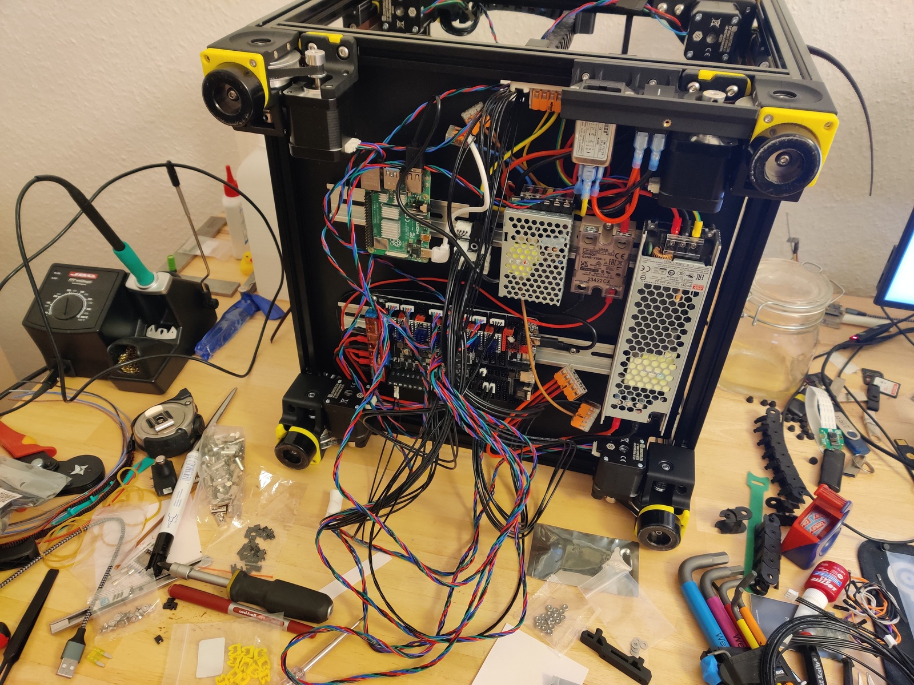
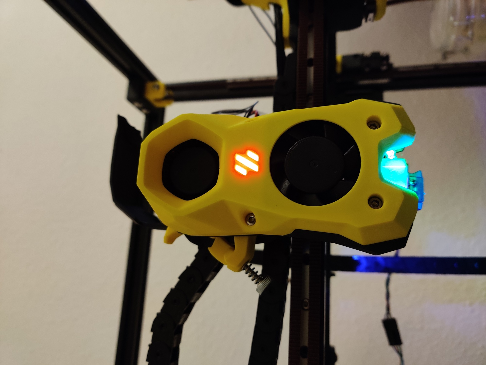

# Voron 2.4 buildlog

This is a technical diary AKA buildlog of me assembling a Voron 2.4r2, 250mm
version.

I try to add annotations where I make mistakes, but in general it’s good to
double-check whether things I’ve described in a step are a good idea before
copying them.

# 2022-10-25

Package arrived. Got Pif parts in blue and yellow.


Around 1m² of desk space cleaned, my trusty Prusa 2.5 went onto the gas oven
(turned off). Build area cleaned, let’s go!


Time: 15min

Downloaded the build manual for Voron (and Stealthburner for later). Initialize
this Git repo. 5min

## Frame assembly

Extrusions sorted and labeled. 10min


Adding screws to A extrusions. I remember my friend telling me about the _frame
spring fasteners_ that they forgot initially. Time to open the
[MagicPhoenix manual](http://mpx.wiki/) as well! Yup, use (non-standard) frame
spring fasteners.

30min later, cube almost finished, forgot thread locker. Fuck. Anyway, time
to get the DIN angle for fine tuning, and the thread locker. Undo all the screws
again. Need to go boudlering though, and threadlocker would set a time limit on
assembly and squaring. Stopping frame assembly for now.

15min of unpacking linear rails, finding a suitable glass, and putting the
sliders into IPA. Now I will go bouldering for real, promise.


Time taken: 1h, total 1h15m.

Reassembled the linear rails while drenching them in IPA. Did not expect the
MGN9H to be _that_ hard to get on the rail, MGN12H is a piece of cake in
comparison. Some balls jumped out, reinserting them is super finnicky. Keeping
them on-rail in IPA for a bit longer, and will move them on occasion. Speaking
of movement, only one of the rails is good (sled moves under its own weight),
the rest is average, except for one of the MGN9H, which is quite stiff. Maybe
upgrade to Hiwin later (for a hefty premium …). 20min for this.

Another 45min later, the frame is fully assembled, and all corners are
electrically connected (diamond filing the contact surfaces). Used a DIN norm
angle to make sure the mechanical assembly is flush. Upper/lower Diagonals are
all 579mm, left/right/front/back ones 594mm without further adjustment. Kudos
to the precision work by MagicPhoenix! Used my DIN angle to check for 90°; most
angles are perfect, some are a tiny bit off so that I can
audibly-but-not-visibly move the angle. Good enough.

I decided against using threadlocker for the frame, because Loctite cures in
around 10-20min, which would not have let me adjust the screws if things
hadn’t gone to plan. Might add Loctite later screw-by-screw when more things
hold the frame in place, but only if problems occur. Screws are tight so that
when I use the hex key with the worse lever, my finger hurts when turning them.

Installed the heat bed rails by estimating the center of the bed with a tape
measure, and going from there with the caliper. Distance between the extrusions
is 130mm±<0.2mm, way more accurate than I need. I do have an offset by 0.5mm
to the left though, which I will worry about when installing the bed, which
should give me much more practical guidance.


Time taken: 1h45m, for a total of 3h so far.


# 2022-10-26: Frame and gantry

## Z linear rails

Spent 15 minutes greasing the rails with standard grease. It’s quite hard to get
it in there, the syringe tip didn’t work (inject it from below through a rail
hole). Just made a little mess and hoped enough would be on the bearings.

The next 45min I installed the rails. I got one nut the wrong way round; it’s
not noticeable but _I know_. It’ll be my secret. Nothing special here, just
juggling with Loctite hardening, and aligning them quick enough. The plastic
rail adjustment clamps are a blessing. Oh and my Yubikey is 3.5mm thick, so I
used that as a spacer for the gap at the bottom of the Z rails.


# DIN rails

15 minutes for installing the floor and DIN rails. Initially I installed the
rails parallel to the bed rails, but they actually have to be perpendicular.
Takes a minute to change that though, so no problem.


The next 30 minutes were pure bliss: heat inserts. It’s amazing. I hope there
are many more. 250 °C on the soldering iron, slowly pushing it in, then flushing
the surface with a flat piece of plastic for a couple of seconds. All inserts
are _perfect_. I’m proud.


The first foot for the frame to stand on took 45 minutes. A couple of small
mistakes were easy to remedy, namely I screwed the foot onto the wrong side of
the frame, and also I forgot including the M5 nut for the plastic foot’s foot to
be fastened to. Neither took more than a minute to fix.


Eyedler are super easy to build and install, maybe 20 minutes. I don’t have a
ball hex key though, so I won’t be able to fasten the belts thanks to their
design.


2h30m Session; the frame is now super done, for a total of 5h30m.

## Gantry

Gantry time! At first I thought Pif had forgotten the B idlers, but the parts
just look different, and everything was there. A couple of heat inserts, lots of
screws that I don’t fasten yet because I don’t know whether I should wait for
the wedding with the frame or not.


This is also when I noticed the reason my Loctite doesn’t yield drops without
extensive begging because – you won’t believe it – it was empty. Visited my
friend to get backup, and also some useful tips for the coming steps. 60 minutes
so far.

2h more gantry assembly. Lots of screws are only tightened a bit, the goal being
joining it with the frame and then working out where everything should be.


It’s now 0:20, the gantry is done, time for the wedding!

0:40 Wedding is done, but I noticed I misunderstood the Z belts: I should
already have added them on lower clamps. That’s going to be finnicky; I think
it’ll be easier to take out the gantry again, fixing the belts, and while I’m at
it tighten some screws. I’ll really have to remember to double-check all the
gantry screws later.


The gantry took me around 3h30m so far, for a total of 9h assembly at this
point.

# 2022-10-27

## Z locks

A cool mod I was recommended is [Z locks][z-locks]. It’s one of those that you
miss when searching for super cool mods before building. It holds the gantry in
place so you can access it without taking it out again. Printed six of them on
the Prusa in less than 2 hours while I was working. The fit is quite tight so
it’s quite secure even if you work on the printer or bump into it. I also cut
the 5m×9mm belt into 1.1m strips of equal length for the Z axes (the manual said
at least 1m for the 250mm printer, so I won’t have usable leftovers anyway).
15min.


[z-locks]: https://github.com/VoronDesign/VoronUsers/tree/master/printer_mods/tallman5/z-locks

The 15min bring the total time to 9h15.

## Belting

30min for inserting the Z belts. I cut them 20cm too long, the »minimum« of 1m
from the manual would still have had 10cm slack as it turns out. This step is
much easier with the whole thing laying on its back; the Z locks are super
helpful, highly recommended.


Another 30 minutes later, the A+B belts are done. Some parts are quite finnicky,
but this is also what made it great fun for me, because there was always some
smart way to thread even the bendiest needles.

Alright, what’s next in the manual, ah yes, both belts must have the same
length, because that’s important for tensioning, symmetry, and stuff. Ah yes,
the design is also built in a way that despite both belts taking different
paths, their lengths match. Wellllll then, I guess I’ll take them out.

30s later, 30min of belting undone. At least I know how to thread them now. Cut
them to equal length to the tooth.


30 more minutes to insert the belts again. I was faster than the first time, but
filled the remainder of the time taken with playing around with the carriage.
Fun was had.

One thing I noticed is that the long M3x40 screw holding the A+B belt clamps
together on the carriage was too long; I used a M3x30 instead, matching the one
in the lower part. The lower one has to leave space for a hall probe magnet, but
still I’m not sure why the top is longer.


Turns out the machine is already deracked, cool! The carriage moves in Y
direction with constant resistance, with no X drift along the way, and hits the
left end right limits simultaneously. The advice of a friend is to take a look
at the [gantry squaring guide by Andrew Ellis][gsq], which features a couple
more steps, but also assumes wiring for many. It looks like a (chapter from a
much more extensive) great guide that I’ll revisit at a later point.

[gsq]: https://github.com/AndrewEllis93/Print-Tuning-Guide/blob/main/articles/voron_v2_gantry_squaring.md

Oh, plus five minutes to tension the gantry bolts, almost forgot! And lol quite
a few of them were _loose_.

Taking some reading, playing around, and writing this text into account, I’ve
spent 2h on the whole belting topic, with a total of 11h15m so far.

# 2022-10-28 Print head, part 1

## Clockwork

More heat inserts, yippee! Although I must say the design is much less friendly.
Some inserts had shallow sockets so the soldering tip penetrated the plastic,
some were hard to reach without melting other parts. None of the mistakes I made
are visible from the outside though, and even if they were they’re very small.


The big gear is supposed to not touch plastic; I therefore moved it inwards as
much as I could. The cost of this is reduced overlap with the driving motor
gear, but we’re talking about less than a mm here on a motor that does not
require much power anyway; it drives filament after all, not a ship’s propeller.


I lubricated the passive extruder gear with trusty Traxxas 50k, a silicon-based
greased that is friendly to plastic, as my collection of Rubik’s Cubes can
attest to. Alignment of parts was pretty easy. I deviated from the manual by
securing the closing latch with a M3x8 SHCS (does fit) instead of M3x6 FHCS
(does not fit) screw.


This step took 1h30m. I no longer wonder why it’s called the clockwork, because
everything is hard to reach and see. Maybe also the big gear. Anyway, 12h45m
build time so far.

# 2022-10-31 Print head, part 2

## Hotend

## Stealthburner

I added the hotend; the orientation is such that the beveled end is facing the
front panel. Cable routing required some small amount of force; orienting the
heater makes the cables fall into place more naturally. I had to use the smaller
SHCS M3x8 screws from the hotend bag, the heads of the main kit were too big and
would not fit the four holes in the plastic part. I cut the PTFE tube to stick
out 10.9mm (should be 11mm), but I think that’s close enough. The socket is
designed to hold this whole part on its own, at least enough for adding the
front later. No zipties had to be used to temporarily hold it in place.


Up next, LED insertion. Smooth sailing; the cables were a bit long, but easily bent into the plastic gaps.


Taking apart the part cooling fan was a bit tricky, but pushing the latches with
my tweezers won after a couple of attempts. I cut off the ears with side
cutters, and filed them down to be somewhat flush. The part doesn’t have to be
super flat, there is some tolerance in the SB head. When staring at the fan from
the front long enough it might not be 100% centered, which might be due to the
non-perfect flush-sanding, but I’ll leave this for a future modding session.


The Klicky probe is easy to install; I did not notice the right way to route its
cable is straight up past the belts and then into a groove made for just that,
and considered just routing it outside. The Voron devs thought of everything it
seems!


Bolted on the front, and mechanical assembly is done! It looks like a Voron now!


With 1h30m in this session, I spent 14h15m on mechanical assembly.


# 2022-11-01 Kickoff for wiring

## Assemble mounts

Raspi, Octopus, SSR: just screwed on the holds without washers. Uneventful. The
power switch is hard to put on the frame when the switch/inlet are put in, so I
had to un-screw it, mount it on the T-nut, and reinsert it. Sexbolt is super
easy to assemble; I added some Traxxas 50k to lubricate it, and of course used
Loctite. The main issue was with the big PSU, it just wouldn’t fit on the DIN
rails. I found out I could simply unscrew the DIN rails, which have a couple of
centimeters play left and right, and retighten them at a more useful distance.


2h30m so far, 2h30m for electric assembly, and total build time 16h45m.

## Octopus setup

For the Octopus, I first removed all jumpers, as the manual says. I then set all
fans and the probe input to 24V and added the drivers. Should I fry the board,
here are pictures of the electrical setup for later reference.


The gap in the drivers line is because motor 2 (0-based indexing) has two slots,
so I’ve skipped motor 2.2 and only used 2.1. **Note:** I later found out this
was a incorrect, it is corrected in a later step! There are 8 driver slots for 8
drivers, but there are 9 motor slots, and the driver in position 2 of 7
(0-based) has two motor slots that can be driven by the same driver. It is valid
wiring, looks awkward, and would at least not fry the board if done this way.

This step took me around 20min, but I also watched a video on how to assemble
the heatbed which I still have to add, bringing the electrical part to 3h, with
a total build time of 17h15m.

## Wiring AC, part 1

Wiring is a pain! I spent 1h15m on trying to figure out the pieces of shit UK
clamps, only to realize that I bought Wago clamps for exactly the same purpose.
I didn’t have the mounting clamp handy, so I printed it in PLA, to be replaced
by an ABS version later. I’ve opted for the extrusion mount (instead of the
DIN-based one) because it seems easier to use, at least until I know where the
wires are running, and where I have space left on the DIN rails. Since I’ll
exchange the PLA part with ABS later anyway, I can use that opportunity to
decide for the other design, should I want to.

4h15m on electrical thus far, total build time 18h.


## Intermezzo: heatbed

I’ve never glued on a heatbed, so here goes nothing! Cleaned the cast aluminium
plate with IPA until _nothing_ was visble on the cloth anymore, then peeled off
a couple of cm of the adhesive cover. Put the entire magnetic sheet on the
surface for alignment, with the partially peeled off cover providing some
resistance so the glue doesn’t stick already. When I was happy with the
alignment (each side a bit wider than the actual aluminium, to be cut off
later), I massaged inside out, with my soldering tip holder plastic piece. It’s
quite the utility, doing this and also helping me with inserting heat inserts
flush! After 15min I was done, no bubble to be seen. I put the result upside
down onto the foam packaging I got the printer parts in, so that the weight of
the plate can help with a bit of pressure when curing.


Next step, the heat sheet. Pretty much the same procedure, same alignment and
partially peeling off tricks, same 15min.


I must say, I think I did this quite well for the first time. No bubbles to be
seen, very symmetric. Since this wasn’t really part of electrical assembly, I’m
leaving that total at 4h15, but the total build time increases to 18h30m.


## Wiring AC, part 2

Meanwhile, the Wago mount clamp has finished printing, time to continure wiring!
Up to a couple of cables that were too short and constrained my choice of
location for some of the parts, everything went smoothly. Thank you Wago.

Turned on power, the switch works, and the green status LEDs of the PSUs light
up as well. 30min (total wiring 4h45m, total 19h).


For the DC circuit, it looks like the cable to connect both V- of the PSUs is
missing. I’ll have to remember adding this later!

The cable routing is a mess, I’m not sure the cable ducts would be an
improvement though, since space is super limited. And it’s going to get much
worse once the printing wiring is added!

A couple of things are still missing in the power circuits:

1. Grounding the frame and the DIN rails
2. Connecting the V- outputs of both PSUs

Other open questions include what the purpose of the BED_POWER connector on the
Octopus is for, since I thought I was using a SSR for providing power from DC,
controlled via the BED_OUT terminal.

Here’s a picture of the current state for your enjoyment.

1h more spent on wiring, so we’re at 5h45m electrical, and 20h total.


# 2022-11-01: fixing mistakes and power wiring

In the last session, I made a couple of mistakes.

1. I misunderstood the bed connectors of the Octopus. The correct way of wiring
   is that the board routes `bed power` to `bed out` based on a Mosfet, and
   controls heating this way.
2. I also misunderstood `motor power`. This is only necessary if the bed power
   is a different one than the board power. In my case, both are 24V (and not,
   say, 48V for the motors), so I can just leave the `motor power` unconnected.
   The jumpers next to the drivers near the edge are in _use board power for
   motors_ position anyway. This wasn’t electrically wrong (phew!), but needed
   additional cables to connect the `motor power` connector, so out it goes. In
   a future mod, since I’m using the huge relais anyway, I could get rid of both
   the bed connectors, and route some thermal regulator pin to the relais
   directly, since it doesn’t need bed power for switching. The setup right now
   is the one one might use when powering the bed directly from the Octopus
   (with 24V).
3. The gap between the drivers isn’t necessary. There are 9 motor outputs with
   motor driver #2 (0-based) having 2, but the drivers themselves are gap-less.
   I rearranged them neatly. The gap will instead be between the motor
   connectors.
4. In general, I looked at the docs for the Octopus _1.x_, and not the Octopus
   _Pro_. Oops. Not too bad at the moment, but would have me scratch my head
   later when looking for specific pinouts.
5. I did not ground the DIN rails or the metallic frame. I’m literally betting
   my life that none of the live wires touches the frame.
6. The V- outputs of the PSUs weren’t connected. They are now. Since I didn’t
   have thick enough black/red cables, I tore apart a power socket cable, and
   used brown/blue instead. I’m sure this violates some DIN, ISO or geneva
   convention rule, but what can I say, I’m just a theoretical physicist, and I
   promise to fix this later™.
7. The Sexbolt had a bit too much resistance on the piston, making me afraid it
   would get stuck in a hot chamber and maybe with time. I took it apart again
   (scratching out the Loctite, ugh), applied a very thin layer of Traxxas 50k
   that I wiped off again because it was maybe too stiff, applied new Loctite,
   and reassembled. The piston now moved under its own weight, and also during
   gentle shaking. Good enough! (Counting the 30m for this towards total, but
   not electronics, time.)


Time for a last check of everything before flipping the power. There will either
be smoke, no smoke but nothing useful, or I will be able to connect to Mainsail
(which I previously installed on the Raspi).

Flick.

LEDs begin to shine. No smoke, no noise.


Mainsail! Woohooo!! (After connecting the LAN cable. I’ll set up Wifi for the
Raspi next.)

The next steps were spent fiddling with a hub that I haven’t used in ages. My
desktop doesn’t have Wifi, I forgot adding Wifi credentials on the Raspi, and my
laptop doesn’t have its SSH key authorized by the Raspi.

Once connection was established, the dashboard wouldn’t appear because some
necessary-and-essential fields, such as the MCU, the kinematics, and motor pins
weren’t specified. I used dummy values copied from an example config to quiet
the errors.

It then could not connect to the MCU. How could it, there is no firmware on the
Octopus after all! I had to get a Micro SD, and followed the
[Klipper documentation to flash the MCU][klipper-flash]. Simple enough, `make` a
bit, then copy the compiled `klipper.bin` onto the SD, renaming it to
`firmware.bin`.

I’ll have to come up with a way to version the files. For now, I’m editing and
copying them between host and Voron manually.

[klipper-flash]: https://docs.vorondesign.com/build/software/octopus_klipper.html

Lo and behold, I have a dashboard! I did not dare push any buttons as to not use
any of the nonsense pins I entered, but we’re in software land now! Well, save
for all the wiring still to be done. The golem has arisen from the dead, while
it is still paralyzed, it is able to think and communicate.


Keeping track of time is becoming more and more complicated. I’m adding 1h for
setting up Mainsail OS on the Raspi (which I had done before the parts even
arrived).
  - Mechanical: 14h15m + 30m (Sexbolt) = 14h45m
  - Electronics: 5h45m + 2h30m (wiring, booting) = 8h15m
  - Software: 1h (MainsailOS)
  - Total: 20h + 4h = 24h


# 2022-11-03

Setting up temperature graphs in Mainsail for the Raspi and MCU temperatures was
simple, and took maybe 15min (software). Now I have some graphs!

Since I skipped bed installation (_way_) earlier, now is the time. The glue has
cured, and I can cut off the excess. I also cut gaps so I can screw the bed to
the rails. The first two are abominations, the second two are alright. I’ll keep
the PEI sheet on as much as I can so nobody notices. 30min mechanical.


Took a break (bouldering), then started a new session at 22:00. Cable chains time!

22:20 toolhead PCB mounted. Needed special part to hold it, but my friend got it
for me ahead of time, cool. (Why does Magicphoenix ship their own non-standard
PCB? Who knows.) Toolhead PCB: 20min. Has internal thermistor (for chamber
temperature measurement, which is a _terrible_ idea to measure so close to the
hotend), but that shares its slot with, well, the only thermistor slot, so that
one goes to the hotend one of course. Fans jumpered to 24V.


22:40 toolhead cable chain mounted, but it’s the thick one, meant for the
electronics-to-gantry part. Argh. Cannot use it because its minimum radius is
too big (and also because it’s needed for the Z axis).

23:00 X cable chain correct. It had just the right length: one element less and
X would be limited, one more and it would hit the window.

23:40. Y cable chain assembled. Left 3 elements out. Realized I forgot the
heater input for the toolhead. Fuck. Fiddle that through the X and Y chains.

1:15. Everything made its way down to the electronics compartment. Cable routing
is surprisingly unfun. I used very few zipties, slacking up the cables is
something I’ll do once wiring is finished at the bottom; the cables are long
enough anyway. Breakout PCB shoehorned onto one of the DIN rails, using a
leftover plastic part as spacer so the soldering tips don’t penetrate the
plastic it lies on. Added Z motor wires, and calling it a day. It’s a terrible,
terrible mess for later clean up.


Times:
  - Mechanical: 14h45m + 30m (bed) = 15h15m
  - Electronics: 8h15m + 3h15 (cable chains) = 11h30m
  - Software: 1h + 15m (temperature graphs) = 1h15m
  - Total: 24h + 4h = 28h

# 2022-11-04

## Session one: wiring

Spent 45m more wiring. Broken window theory proves correct again, I’m making
more of a mess because there is a mess already.



Started machine: does not smoke. Connect to Mainsail. I see the heater
temperature!

## Session two: configuration out of home

Time for some configuration. Spent two hours giving the pins aliases. I did not
have the Voron available, so I configured the motors blindly with _lots_ of TODO
entries. Around 2h spent on software here.

## Session three: back home

### Wiring

My workplace is a terrible mess, the Voron’s wiring pales in comparison. I’m
starting to dislike having to literally jump over and losing other things. 15m
spent on cleanup, which was surprisingly quick to get back to a reasonable
level.

The next hour went into installing the Sexbolt (super quick) and the bed wiring
(not super quick since MagicPhoenix made the connector too big to pass through,
so I cut, crimped and wago’d it). I dread the wire cleanup. But config and
testing first! I also removed the circuits to bed in/out ports of the Octopus,
since the bed pulls its power from mains via the big relais, and that one can be
triggered using a normal heater output.

I thought about skipping LED wiring for now, but I’m glad I went for it, because I was missing a cable! Where was it? Turns out I wired probe1 (meant for inductive) instead of probe0 (Klicky). Klicky has two poles, inductive 3, so that’s where my cable was hiding! Anyway, LED wired, Klicky wired.

### Stepper buzzing

Time to test the motors! Wiggle them using

```bash
STEPPER_BUZZ STEPPER=stepper_x  # moves towards front/right
STEPPER_BUZZ STEPPER=stepper_y  # moves towards back/right
STEPPER_BUZZ STEPPER=stepper_z
STEPPER_BUZZ STEPPER=stepper_z1 # needs inversion
STEPPER_BUZZ STEPPER=stepper_z2
STEPPER_BUZZ STEPPER=stepper_z3
STEPPER_BUZZ STEPPER=extruder   # E>0 moves up; not sure what direction is right
```

All motors move, but both steppers going towards the right when buzzing sounds
wrong. There’s [a helpful entry in the MagicPhoenix wiki][mpx-corexy-debug] to
help with that though. I can’t move the gantry without homing it first though.
Is there an override? Let’s worry about homing first.

[mpx-corexy-debug]: https://mpx.wiki/corexy_incorrect_xy_direction

### Homing switches

Klipper has a handy endstop test section in the machine config (why _there_?).
Manually triggered them and looked for a change in state. XYZ work, but Klicky
probe does not register.

Without homing, I can’t move; without moving, I can’t figure out what physical
direction the logical direction X corresponds to. But I _can_ set the homing
speed super slow and home! X goes in the right direction (right side), while Y
is inverted (towards front instead of back). The
[MagicPhoenix wiki][mpx-corexy-debug] says to flip motors in that case, which
was indeed the solution.


### LEDs

Configuring LEDs is pretty simple. Add the config section, use `SET_LED` to set
colors. Indexing starts at 1. Moved LED config to a sub-file, which is something
I’ll be doing with most config files in the future. Note: scp is garbage at
copying directories. It took me longer than a minute to do so correctly, so I
gave up (will downloading work, who knows, will it override my home dir, who
knows). Seriously, fuck the UX and manpages of _so many_ Linux tools.



!!! 2h, already entered into timesheet

### Fans

The fans worked right away. The part cooling fan can be controlled, the hotend
fan was tested by setting its threshold temperature to 10°C.

### Hotend heating

Bed and hotend were within a degree from each other, which I estimated is the
resolution of the thermal probes. Hotend fan worked. Time to heat it up, no? It
worked, but overshot the (conservative) target of 60°C by about 3°C. It’s
reassuring that the hotend cooling fan turned on immediately, and stayed on
until the temperature dropped below 50°C. Overshooting by 3°C isn’t that great
though at a test temperature of 60°C. I also heated to 100°C, 200°C and 260°C
(ABS printing temperature), it worked as expected. Once cooled down a bit I
think it’s time for PID calibration via
`PID_CALIBRATE HEATER=extruder TARGET=60`.

### Bed heating

Same procedure. 60°C first, works, with a single cracking noise; something
wasn’t set yet. I’m not too worried, because I did leave the screws of the bed
pretty loose, as per the instructions. Next, get some PID calibration for the
bed via `PID_CALIBRATE HEATER=heater_bed TARGET=60`.

While waiting for the results, I figured I might as well try out the extruder,
and indeed, as suspected in the buzzing test, it goes the wrong way. A simple
reversal of the direction pin should fix this.


### Chamber temperature sensor

Added sensor to config, reading looks okay, slightly above room temperature,
which makes sense after the bed heating test.

Times:
  - Mechanical: 15h15m + 15m (sexbolt, cleanup) = 15h30m
  - Electronics: 11h30m + 1h45m (bed, thermistors, sexbolt) = 13h15m
  - Software: 1h15m + 2h (config, blind) + 3h (config: buzz, homing, LEDs, fans, heating) = 6h15m
  - Total: 28h + 7h = 35h


# 2022-11-05

## Trello

I’m losing track of things to do, so I’ve created a Trello board to keep my
TODOs better than as a loose collection of comments here. Let’s see how that
goes.

## Sexbolt Re-reassembly

The bed of the MagicPhoenix kit is a bit higher than the normal bed, so the
Sexbolt was sitting too low for the nozzle to touch. Took it apart again
(distance to bed: 2.6mm), removed the Loctite residue with acetone (doesn’t work
that well, but worth a try) and reassembled it, but adding just a bit shy of
2.6mm to the screw by not fastening it to the end.

## Fixing the Klicky

The Klicky probe would not trigger during the previous end stop switch test. I
quickly debugged this by ~~being a genius~~ remembering my friend mentioning a
similar problem. And indeed, comparing the pinouts of the Octopus and breakout
PCB, it turns out the cable was flipped: GND went to signal and the other way
round! Seems like it’s a bug in the MacigPhoenix kit, and not a one-time fluke.
Using some very sharp pliers I undid the PCB plug and flipped polarity.

Tested it, and: it works! When attached, it triggers when pressed and does not
trigger when not. When not attached, it is set to triggered, so that failing to
pick it up for some reason does not start probing the bed without it.

## Configuring Z homing

Z homing has to be done by pushing the nozzle onto the Sexbolt, so the location
has to be precisely configured. But wait, I can’t do that because the travel on
the X/Y axes isn’t set correctly, so the Sexbolt position is not know so …

## Calibrating X/Y axes

This is a simple calculation,

rotation_distance = <full_steps_per_rotation = 200> * <microsteps = 32> / <steps_per_mm>
steps_per_mm = 200 steps/rotation * 1/20 rotations/tooth * 1/2 tooth/mm


## Z homing, for real now

Homed X and Y, started Z homing to move Z close to the bed, triggering the
Sexbolt when the nozzle was close to it. Then manually moved XY to (180, 257),
right above the Sexbolt. Homing works! I just have to be careful the wires still
hanging out of the toolhead don’t catch on anything. Zip ties are on the TODO
list.

## Adjusting Klicky height

I put in the Klicky holder without worrying about its height or alignment. This
requires some mechanical disassembly. Turns out it’s super easy! 5 minutes max.
Unscrewed Stealthburner (4 screws), took out hotend, adjusted Klicky holder to
be at the very bottom, put everything back together. I chose the very bottom
because it was already on that height on one screw, and it looked okay before,
just a bit slanted.

I also downloaded the [Klicky macros from the Github page][github-klicky-macros].

[github-klicky-macros]: https://github.com/jlas1/Klicky-Probe/tree/main/Klipper_macros


## LEDs misbehave

I noticed the LEDs sometimes show the wrong color, e.g. (R,G,B) = (1,0,0) yields
a teal LED. I don’t care about it enough to debug it right now, but it’s
something to fix later.

## Calibrate extruder, part 1

When ordered to extrude 10cm of filament, the extruder should do just that.
Apparently that’s often not the case, so I’ll start melting some first plastic!
Window is open because I have an un-enclosed un-nevermored cancer fume machine.
I’ve also tightened the nozzle, carefully, with a size 7 nut (and only a nut).

Now: unpack some ABS, and heat the hotend to 250 °C. Before doing this, I
noticed that it won’t let me extrude anymore because nozzle temperature is below
200°C, which I had previously configured. Nice! I then inserted some filament
(Esun black) with the clockwork open, pushed it all the way through, and got my
first extrusion.


Next step, calibration. I cut off the filament at 40mm above the Clockwork, and
told it to extrude 30mm. It extruded maybe one in this extrusion test #1. Come
to think of it, I should have done some config sanity checks before! Anyway,
22mm are still sticking out, so I extruded 40mm-22m=18mm, off by a factor of
30mm/18mm. I could now modify the config value by this factor but – wait, I have
this config value twice (33.500 and 22.6789511 a bit further down)! What’s the
setting Klipper actually uses in this case? Argh.

I’m keeping the value of 22.6789511, which the documentation says it’s a »good
starting point«. A very specific one, but okay. Alright, ew filament. Wait, how
do I change filament? Umm retract a bit, open Clockwork, and pull I guess. Works
well enough, although I’m a bit worried this might get some molten plastic onto
the extruder gears.

Extrusion test #2. This time, I put a little indicator (electrical tape) onto
the filament at 100mm. Ordered once again 30mm for extrusion, 18mm were
_actually_ extruded. I guess now I know that later values override previous one
in Klipper (at least in this case). The good news is that I can just apply the
factor 30/18 from above to the `rotation_distance`, which is then $22.6789511
\otimes \frac{18}{30}$. Wait, what’s $\otimes$? It’s the
I-don’t-know-whether-to-multiply-or-divide operator. Does 37.8 or 13.6 sound
like a more plausible result value? Underextrusion (18mm instead of 30mm) means
the rotation distance is too high, so the gears move less to extrude some
amount. 13.6(…) it is!

New attempt, extrude 30mm; marker went from 83mm to 53mm. Pretty good!


For some finer calibration, I’ll use up the rest of the test filament I’ve
inserted. While at it, I might as well use my caliper for some better
measurements. Moved filament marker way up. 177.33mm it says. Alright, extrude
150mm! Wait, skipped steps? Fuck fuck fuck. The heater has turned off in the
meantime, I extruded at slightly above 200°C so the safety didn’t kick in, but
extruding cooled the nozzle to 170°C. At least nothing broke! Alright, fiddling
with filament pieces is annoying, I’m getting the spool holder ready. For some
reason that one is part of Pif, even though it’s not super necessary to get
anything done (unlike e.g. the side panel fasteners, which are pretty much
_required_ for ABS printing).

## Spool holder

Simple enough, followed the instructions. I didn’t glue the PTFE tube into the
holder because it is bent in one direction from being spooled up, and that could
be used to have a tight mechanical fit.

## Calibrate extruder, part 2

I cut ~10mm of PTFE tube open so I could clip it around the filament, which now
has its other end hidden deep into a big spool. This is my new extrusion marker.
Good idea, but unfortunately both hard to get onto the filament, and then it
doesn’t hold onto it very well, because completely unknown to me, PTFE is quite
slippery. Back to electrical tape it is.

Extrusion test #3. 192.81mm until marker, extrude 150mm at 5mm/s
(note: 10mm/s skips steps!). Marker is now at 45.52mm, so actual feed was
(192.81 - 45.52)mm = 147.29mm, underextrusion, `rotation_distance` is too high
by a factor of 150mm/147.29mm. Old `rotation_distance`) * 147.29/150 is the new
value, 13.36(…).

Extrusion test #4. 203.31mm until marker, extrude 150mm at 5mm/s. 52.91mm until
marker, 150.39mm extruded. We’re in sub-mm territory, good enough, but since we
already have the value, I might as well add another round of calculation. This
time it was an overextrusion, so the `rotation_distance` needs to increase by a
whopping 150.39/150. (We’re well below my measurement accuracy, and of course
the filament isn’t straight, but this is fun so I’m still doing it.)

Final value: `rotation_distance = 13.396270810234196`. Extruder calibration
done! Only took about 2h30m.

Times (it’s been a while, time for an inter-session summary):
  - Mechanical: 15h30m + 15m (Sexbolt boogaloo) + 15m (spool holder) = 16h
  - Electronics: 13h15m + 30m (Klicky) + 15m (fooling around) = 14h
  - Software: 6h15m + 1h (axes calibration, Z homing) + 2h30m (extruder config) = 9h45m
  - Total: 35h + 4h45m = 39h45

## Klicky probe: attaching, homing, docking

The next blocker on the way to the first print is the Klicky probe, for which I
have only ensured it triggers correctly.

First part, mechanical assembly. Super simple, two heat set inserts, T nuts into
extrusions, 15min, done.

Software is next. Surely I’ll need the Klicky location for that, so let’s figure
this out. Wait a second, the holder on the print head crashes into the
gantry-attached holder if I do that, the toolhead holder is too low. But even if
I fix that, doesn’t that mean part of the print bed is inaccessible, because
during a print the Klicky would be picked up?

I just worked on configuration for 2h, let’s see what I can still remember for
the build log. So, homing XYZ works, but is now done by the Klicky scripts,
which override the normal homing procedure to take into account that the probe
might still be attached. Other than that, they’re not that different.

The general idea is that the Klicky is outside of the printable area, around 1cm
besides the bed, so that it does not constrain the printable area. The location
of the probe is configured in the XY plane, and since it is attached to the
gantry, co-moving with and thus independent of Z. G28 (home all) drops the probe
if necessary, then does a usual homing cycle of X, Y, then Z. The `attach_probe`
picks up the probe coming from the front, and `dock_probe` moves it back into
its dock and gets rid of it by moving to the positive Y direction. This is my
test program:

```
G28
attach_probe
G01 X125 Y125 # Probing stuff goes here
dock_probe
```

Configuration wise, I’ve simply copied the `Klipper_macros/*.cfg` files of the
[Klicky repository][klicky-github] onto the printer. `klicky-variables.cfg` is
the configuration, the rest of the files don’t have to be touched for this step.
I heavily reduced all speeds for the probe for testing; however, the only
crucial setting is the `docklocation`, which much like the location of the
Sexbolt, I manually figured out by nudging the print head there.

[klicky-github]: https://github.com/jlas1/Klicky-Probe

Times:
  - Mechanical: 16h + 15m (Klicky)
  - Electronics: 14h
  - Software: 9h45m + 2h (Klicky)
  - Total: 39h45

## Quad Gantry Leveling

QGL probes the bed on its four corners, and adjusts the Z motors so the gantry
is parallel to the print bed. Configuration is simple enough, it pretty much
comes out of Klicky and setting the probing coordinates.
